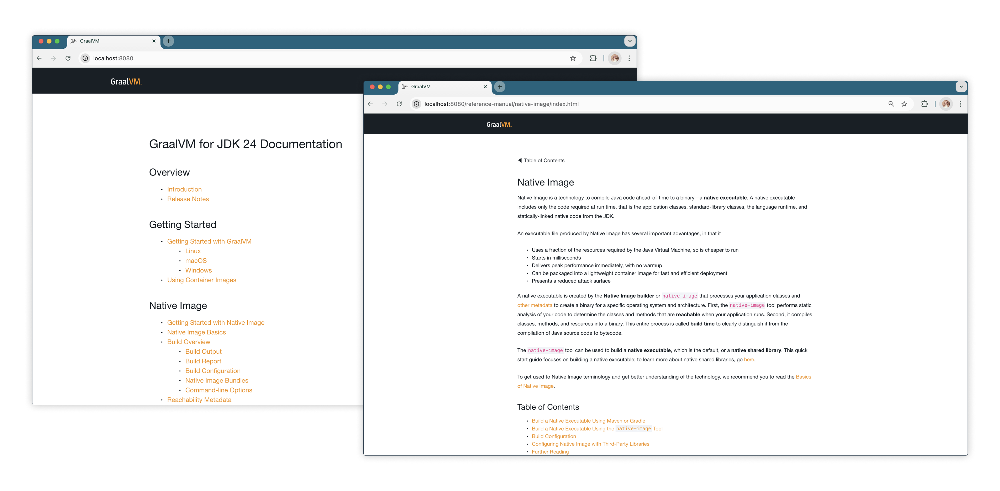

# Micronaut: The Path to Efficient Java Containers

This workshop demonstrates how to serve static assets with [Micronaut](https://micronaut.io/) directly from the resources folder, without relying on [Micronaut Views](https://micronaut-projects.github.io/micronaut-views/latest/guide/) or its templating support.
The application serves the latest GraalVM release documentation so you can benchmark accurately.

Another key objective is to show how to **build size-optimized native applications** with [GraalVM Native Image](https://www.graalvm.org/latest/reference-manual/native-image/) and deploy them in various containers to optimize the runtime environment.
Micronaut has first-class support for Native Image, simplifying project setup and configuration.

Each step in this workshop is implemented as a multistage build.
It uses the [Oracle GraalVM container image](https://container-registry.oracle.com/ords/ocr/ba/graalvm) as the builder and explores different base images for the runner.
Each step is automated via scripts and Dockerfiles, and the application serves real, production-like content.

Yet once compiled into a JAR and placed in a Docker container with a full JDK (`eclipse-temurin:21base`), this Micronaut web server weighs approximately 582MB.
From there, you will iteratively reduce its size by testing alternative packaging strategies: replacing the JVM with custom runtimes, using native executables, and ultimately producing fully static binaries.

### Objectives

In this workshop you will:

- Deploy the application in different containers to optimize the runtime environment.
- Compile a Micronaut application ahead of time into a native image and optimize it for file size.
- Learn about different file size optimization options that Native Image offers.
- See how to apply the [Maven plugin for Native Image](https://graalvm.github.io/native-build-tools/latest/maven-plugin.html).
- Reduce containers size by taking advantage of different Native Image static linking options.
- Compare the deployed container images sizes and discuss the trade offs, focusing on two main strategies: distroless and static.

### Prerequisites

* x86 Linux
* `musl` toolchain
* Container runtime such as [Docker](https://www.docker.com/gettingstarted/), or [Rancher Desktop](https://docs.rancherdesktop.io/getting-started/installation/) installed and running.
* [GraalVM for JDK 24](https://www.graalvm.org/downloads/). We recommend using [SDKMAN!](https://sdkman.io/). (For other download options, see [GraalVM Downloads](https://www.graalvm.org/downloads/).)
    ```bash
    sdk install java 24-graal
    ```

## Setup

1. Clone this repository with Git and enter the application directory:
    ```bash
    git clone https://github.com/graalvm/workshops.git
    ```
    ```bash
    cd native-image/micronaut-webserver
    ```

2. Unzip the static resources required for the application:
    ```bash
    unzip src/main/resources/static.zip -d src/main/resources
    ```

3. Run the _build-jar-eclipse-temurin.sh_ script from the application directory:
    ```bash
    ./build-jar-eclipse-temurin.sh
    ```
    Once the script finishes, a container image _eclispe-temurin-jar_ should be available.
    Check its size. It should be **582MB**.
    ```bash
    docker images
    ```
    This container uses `eclipse-temurin:21` as a base image for the runtime, which contains a full JDK.
    Now that you have the demo application and the initial container size, proceed to the steps.

## **STEP 1**: Compile and Run the Application from a JAR File Inside a Container

Start by compiling and running the application from a JAR file inside a Docker container.
It requires a container image with a JDK and runtime libraries.

### Explanation

The Dockerfile provided for this step pulls [container-registry.oracle.com/graalvm/jdk:24](https://docs.oracle.com/en/graalvm/jdk/24/docs/getting-started/container-images/) for the builder, and then `gcr.io/distroless/java21-debian12` for the runtime.
Using a `distroless java21-debian12` base image instead of `eclipse-temurin:21` should drop down the container size significantly.
The entrypoint for this image is equivalent to `java -jar`, so only a path to a JAR file is specified in `CMD`.

### Action

1. Run the _build-jar-java-base.sh_ script from the application directory:
    ```bash
    ./build-jar-java-base.sh
    ```

2. Once the script finishes, a container image _distroless-java-base.jar_ should be available. Start the application using `docker run`:
    ```bash
    docker run --rm -p8080:8080 webserver:distroless-java-base.jar
    ```
    The container started in hundreds of milliseconds, **316ms**.

3. Open a browser and navigate to [localhost:8080/](http://localhost:8080/). You see the GraalVM documentation pages served.

   

4. Return to the terminal and stop the running container by clicking CTRL+C. (The Docker runs in attached mode.)

5. Check the container size:
    ```bash
    docker images
    ```
    ```
    REPOSITORY   TAG                        IMAGE ID       CREATED          SIZE
    webserver    distroless-java-base.jar   e285476a8266   32 minutes ago   306MB
    webserver    eclispe-temurin-jar        f6eef8d2aa40   33 minutes ago   582MB
    ```
    Note that the website pages added **44MB** to the overall image size.
    **306MB** is not bad for Java, but not great if you're optimizing for cold start and footprint.

## **STEP 2**: Build and Run a Jlink Custom Runtime Image Inside a Container

In this step, you will create a custom runtime for this Micronaut web application with Jlink and run it inside a container image.
See how much reduction in size you can gain.

### Explanation

Jlink, or `jlink`, is a tool that generates a custom Java runtime image that contains only the platform modules that are required for your application.
This is one of the approaches to make applications more space efficient and cloud-friendly, introduced in Java 11.

The script _build-jlink.sh_ that runs `docker build` using the _Dockerfile.distroless-java-base.jlink_.
The Dockerfile runs two stages: first it generates a Jlink custom runtime on a full JDK (`container-registry.oracle.com/graalvm/jdk:24`); then copies the runtime image folder along with static assets into a distroless Java base image, and sets the entrypoint.
Distroless Java base image provides `glibc` and other libraries needed by the JDK, **but not a full-blown JDK**.

The application does not have to be modular, but you need to figure out which modules the application depends on to be able to `jlink` it.
In the builder stage, running on a full JDK, after compiling the project, Docker creates a file _cp.txt_ containing the classpath with all the dependencies:
```
RUN ./mvnw dependency:build-classpath -Dmdep.outputFile=cp.txt
```
Then, Docker runs the `jdeps` command with the classpath to check required modules for this Micronaut application:
```bash
RUN jdeps --ignore-missing-deps -q  --recursive --multi-release 24 --print-module-deps --class-path $(cat cp.txt) target/webserver-0.1.jar
```
Finally, Docker runs `jlink` to create a custom runtime in the specified output directory _jlink-jre_.
The `ENTRYPOINT` for the application would be `java` from the custom runtime.

### Action

1. Run the script:
    ```
    ./build-jlink.sh
    ```

2. Once the script finishes, a container image _distroless-java-base.jlink_ should be available. Run it, mapping the ports:
    ```bash
    docker run --rm -p8080:8080 webserver:distroless-java-base.jlink
    ```

    The container started in **1.193 seconds**.

3. Open a browser and navigate to [localhost:8080/](http://localhost:8080/). You see the GraalVM documentation pages served.

4. Return to the terminal and stop the running container by clicking CTRL+C.

5. Compare the file size of container images:
    ```bash
    docker images
    ```
    The expected output is:
    ```
    REPOSITORY   TAG                          IMAGE ID       CREATED          SIZE
    webserver    distroless-java-base.jlink   2a33effa1e0f   3 minutes ago    257MB
    webserver    distroless-java-base.jar     e285476a8266   32 minutes ago   306MB
    webserver    eclispe-temurin-jar          f6eef8d2aa40   33 minutes ago   582MB
    ```
    Jlink shrinked the `distroless-java-base.jar` container by **49MB**.
    There is no dramatic performance change, but a solid step toward efficiency.

## **STEP 3**:  Build a Native Image and Run Inside a Container (Default Configuration)

In this step, you will compile the Micronaut application ahead of time using GraalVM Native Image, with the default configuration, and run it inside a container.

### Explanation

Micronaut provides built-in support for GraalVM Native Image.
For example, when generating a new project with [Micronaut Launch](https://micronaut.io/launch/), you add **graalvm** as a packaging feature.
To create a native executable for this application using Maven, on your machine, simply run:
```bash
./mvnw package -Dpackaging=native-image
```
This command compiles the application ahead of time and produces a fully dynamically linked native image in the _target/_ director.

For this step, we provide a Dockerfile, _Dockerfile.distroless-java-base.dynamic_, that runs the native image build step inside the builder container, and then copies this native executable in a distroless base container with just enough to run the application.
No Java Runtime Environment (JRE) is required!

**Distroless container images** contain only your application and its runtime dependencies.
They do not contain package managers, shells or any other programs you would expect to find in a standard Linux distribution.
Learn more in ["Distroless" Container Images](https://github.com/GoogleContainerTools/distroless).

### Action

1. Run the script:
    ```
    ./build-dynamic-image.sh
    ```

2. Once the build completes, a container image _distroless-java-base.dynamic_ should be available. Run it, mapping the ports:
    ```bash
    docker run --rm -p8080:8080 webserver:distroless-java-base.dynamic
    ```

The application is running from the native image inside a container. The container started in **12ms**!

3. Open a browser and navigate to [localhost:8080/](http://localhost:8080/). You see the GraalVM documentation pages served.

4. Return to the terminal and stop the running container by clicking CTRL+C.

5. Check the size of this container image:
    ```bash
    docker images
    ```
    The expected output is:
    ```bash
    REPOSITORY   TAG                            IMAGE ID       CREATED          SIZE
    webserver    distroless-java-base.dynamic   53af84312571   5 minutes ago    246MB
    webserver    distroless-java-base.jar       e285476a8266   32 minutes ago   306MB
    webserver    eclispe-temurin-jar            f6eef8d2aa40   33 minutes ago   582MB
    ```
    The new container image size is **246MB** and contains a dynamically linked native image of this Micronaut web server.
    Note that the static resources are "baked" into this native executable.

    Ahead-of-time compilation not only reduced the container size, but also cut startup time by 25×—from hundreds of milliseconds to just 10 milliseconds.
    That's how powerful native compilation can be!

## **STEP 4**: Build a Size-Optimized Native Image and Run Inside a Container

_This is where the fun begins._

In this step, you will build a fully dynamically linked native image **with the file size optimization on** and run it inside a container.

### Explanation

GraalVM Native Image provides the option `-Os` which optimizes the resulting native image for file size.
`-Os` enables `-O2` optimizations except those that can increase code or executable size significantly.
Learn more about different optimization levels in the [Native Image documentation](https://www.graalvm.org/jdk24/reference-manual/native-image/optimizations-and-performance/#optimization-levels).

To configure the Native Image build and have more manual control over the process, GraalVM team provides the [Native Build Tools](https://graalvm.github.io/native-build-tools/latest/index.html): Maven and Gradle plugins for building native images.

The project configuration already contains the [Native Image Maven plugin](https://graalvm.github.io/native-build-tools/latest/index.html) declaration, within a Maven profile.
[Maven profiles](https://maven.apache.org/guides/introduction/introduction-to-profiles.html) are a great way to have different build configurations within a single _pom.xml_ file.

For convenience, you can have a separate Maven profile for each step, adding the plugin into it.
This way you can differentiate from the default build, and give a different name for the output file.

Below is the breakdown of the plugin declaration and build configuration for this step:
```xml
  <profile>
    <id>dynamic-optimized</id>
    <build>
      <plugins>
        <plugin>
          <groupId>org.graalvm.buildtools</groupId>
          <artifactId>native-maven-plugin</artifactId>
          <version>0.10.6</version>
          <configuration>
            <imageName>webserver.dynamic-optimized</imageName>
            <buildArgs>
                <buildArg>-Os</buildArg>
            </buildArgs>
          </configuration>
        </plugin>
      </plugins>
    </build>
 </profile>
```

> An alternative way to pass build options to Native Image, without creating Maven profiles, is by using `-DbuildArgs`:
```bash
./mvnw package -Dpackaging=native-image -DbuildArgs="-Os,-o target/webserver.dynamic-optimized"
```

The Dockerfile for this step, _Dockerfile.distroless-java-base.dynamic-optimized_, creates a native image which is fully dynamically linked and **optimized for size** inside the builder container, and then packages it in a distroless base container with just enough to run the application.
No Java Runtime Environment (JRE) is required.

> The `-Os` optimization will be on for all the subsequent builds.

### Action

1. Run the script to build a size-optimized native executable and package it into a container:
    ```bash
    ./build-dynamic-image-optimized.sh
    ```

2. Once the build completes, a container image _distroless-java-base.dynamic-optimized_ should be available. Run it, mapping the ports:
    ```bash
    docker run --rm -p8080:8080 webserver:distroless-java-base.dynamic-optimized
    ```

    The application is running from the native image inside a container. The container started in **10ms**.

3. Open a browser and navigate to [localhost:8080/](http://localhost:8080/). You see the GraalVM documentation pages served.

4. Return to the terminal and stop the running container by clicking CTRL+C.

5. Check the size of this container image:
    ```bash
    docker images
    ```
    The expected output is:
    ```bash
    REPOSITORY   TAG                                      IMAGE ID       CREATED         SIZE
    webserver    distroless-java-base.dynamic-optimized   5e16a58b1649   23 seconds ago  220MB
    webserver    distroless-java-base.dynamic             d7c449b9373d   45 seconds ago  246MB
    webserver    distroless-java-base.jar                 e285476a8266   32 minutes ago  306MB
    webserver    eclispe-temurin-jar                      f6eef8d2aa40   33 minutes ago  582MB
    ```

    The binary size decreased by **29MB** (from 194MB to 165MB) just by applying the file size optimization - with no change in behavior or startup time!
    The size of the container is cut down from **246MB** to **220MB**.

## **STEP 5**: (Optional) Build a Size-Optimized Native Image with SkipFlow and Run Inside a Container

In this step, you will build another fully dynamically linked native image but with the **SkipFlow** and **file size** optimizations on. Then you run it inside a container.

### Explanation

As of GraalVM for JDK 24, you can enable [SkipFlow](https://www.graalvm.org/release-notes/JDK_24/#native-image)-an extension to the Native Image static analysis that tracks unreachable branches to reduce code paths that may never run.
The feature is experimental and can be enabled with the following host options: `-H:+TrackPrimitiveValues` and `-H:+UsePredicates`.

For that, a separate Maven profile is provided, giving a different name for the output file:
```xml
<profile>
    <id>dynamic-skipflow-optimized</id>
    <build>
        <plugins>
            <plugin>
                <groupId>org.graalvm.buildtools</groupId>
                <artifactId>native-maven-plugin</artifactId>
                <configuration>
                    <imageName>webserver.dynamic-skipflow</imageName>
                    <buildArgs>
                        <buildArg>-Os</buildArg>
                        <buildArg>-H:+UnlockExperimentalVMOptions</buildArg>
                        <buildArg>-H:+TrackPrimitiveValues</buildArg>
                        <buildArg>-H:+UsePredicates</buildArg>
                    </buildArgs>
                </configuration>
            </plugin>
        </plugins>
    </build>
</profile>
```

> An alternative way to pass build options to Native Image, without creating Maven profiles, is by using `-DbuildArgs`:
```bash
./mvnw package -Dpackaging=native-image -DbuildArgs="-Os,-H:+UnlockExperimentalVMOptions,-H:+TrackPrimitiveValues,-H:+UsePredicates,-o target/webserver.dynamic-skipflow"
```

The Dockerfile for this step, _Dockerfile.distroless-java-base.dynamic-skipflow_, is pretty much the same as before: running a native image build inside the builder container, and then copying it over to a distroless base container with just enough to run the application.
No Java Runtime Environment (JRE) is required.

### Action

1. Run the script to build a size-optimized native executable and package it into a container:
    ```bash
    ./build-dynamic-image-skipflow.sh
    ```

2. Once the build completes, a container image _distroless-java-base.dynamic-optimized_ should be available. Run it, mapping the ports:
    ```bash
    docker run --rm -p8080:8080 webserver:distroless-java-base.dynamic-skipflow
    ```

    The application is running from the native image inside a container.
    The startup time has not changed.

3. Open a browser and navigate to [localhost:8080/](http://localhost:8080/). You see the GraalVM documentation pages served.

4. Return to the terminal and stop the running container by clicking CTRL+C.

5. Check the size of this container image:
    ```bash
    docker images
    ```
    The expected output is:
    ```bash
    REPOSITORY   TAG                                      IMAGE ID       CREATED              SIZE
    webserver    distroless-java-base.dynamic-skipflow    6caada87f616   About a minute ago   219MB
    webserver    distroless-java-base.dynamic-optimized   9b48cfa87493   14 minutes ago       220MB
    webserver    distroless-java-base.dynamic             267c09b0a6d7   18 minutes ago       246MB
    webserver    distroless-java-base.jlink               457473f123ac   24 minutes ago       257MB
    webserver    distroless-java-base.jar                 e285476a8266   32 minutes ago       306MB
    webserver    eclispe-temurin-jar                      f6eef8d2aa40   33 minutes ago       582MB
    ```
    The gain is tiny: the container size reduced only by 1MB, from 220MB to **219MB**, but depending on the application, **SkipFlow can provide up to a 4% reduction in binary size without any additional impact on build time**.

## **STEP 6**: Build a Size-Optimized Mostly Static Native Image and Run Inside a Container

In this step, you will build a **mostly static** native image, with the file size optimization on, and then package it into a container image that provides `glibc`, and run.

### Explanation

A **mostly static** native image links all the shared libraries on which it relies (`zlib`, JDK-shared static libraries) except the standard C library, `libc`.
This type of native image is useful for deployment on a distroless base container image.
You can build a mostly statically linked image by passing the `--static-nolibc` option at build time.

A separate Maven profile exists for this step:
```xml
<profile>
    <id>mostly-static</id>
    <build>
        <plugins>
            <plugin>
                <groupId>org.graalvm.buildtools</groupId>
                <artifactId>native-maven-plugin</artifactId>
                <configuration>
                    <imageName>webserver.mostly-static</imageName>
                    <buildArgs>
                        <buildArg>--static-nolibc</buildArg>
                        <buildArg>-Os</buildArg>
                    </buildArgs>
                </configuration>
            </plugin>
        </plugins>
    </build>
</profile>
```

> An alternative way to pass build options to Native Image, without creating Maven profiles, is by using `-DbuildArgs`:
```bash
./mvnw package -Dpackaging=native-image -DbuildArgs="--static-nolibc,-Os,-o target/webserver.mostly-static
```

### Action

1. Run the script:
    ```bash
    ./build-mostly-static-image.sh
    ```

2. Once the build completes, a container image _distroless-base.mostly-static_ should be available. Run it, mapping the ports:
    ```bash
    docker run --rm -p8080:8080 webserver:distroless-base.mostly-static
    ```

    The application is running from the mostly static native image inside a container. The container started in **19ms**.

3. Open a browser and navigate to [localhost:8080/](http://localhost:8080/). You see the GraalVM documentation pages served.

4. Return to the terminal and stop the running container by clicking CTRL+C.

5. Check the size of this container image:
    ```bash
    docker images
    ```
    The expected output is:
    ```bash
    REPOSITORY   TAG                                      IMAGE ID       CREATED          SIZE
    webserver    distroless-base.mostly-static            af0a790a6558   2 minutes ago    207MB
    webserver    distroless-java-base.dynamic-skipflow    6caada87f616   6 minutes ago    219MB
    webserver    distroless-java-base.dynamic-optimized   9b48cfa87493   19 minutes ago   220MB
    webserver    distroless-java-base.dynamic             267c09b0a6d7   23 minutes ago   246MB
    webserver    distroless-java-base.jlink               457473f123ac   30 minutes ago   257MB
    webserver    distroless-java-base.jar                 e285476a8266   32 minutes ago   306MB
    webserver    eclispe-temurin-jar                      f6eef8d2aa40   33 minutes ago   582MB
    ```

    The size of the new _distroless-base.mostly-static_ container is **207MB**.
    The reduction in size is related to the fact that a smaller base image was pulled: **gcr.io/distroless/base-debian12**.
    [Distroless images](https://github.com/GoogleContainerTools/distroless) are very small, and the one used is only **48.3 MB**.
    The size of the mostly static native image has not changed, and is **165MB**.

## **STEP 7**: Build a Size-Optimized Fully Static Native Image and Run Inside a Container

In this step, you will build a **fully static** native image, with the file size optimization on, and then package it into a _scratch_ container.

### Explanation

A **fully static** native image is a statically linked binary that you can use without any additional library dependencies.
You can create a static native image by statically linking it against `musl-libc`, a lightweight, fast, and simple `libc` implementation.
To build a fully static executable, pass the `--static --libc=musl` options at build time.

A fully static image **does not rely on any libraries in the operating system environment** and can be packaged in the tiniest container.

It is easy to deploy on a slim or distroless container, even a [_scratch_ container](https://hub.docker.com/_/scratch).
A _scratch_ container is a [Docker official image](https://hub.docker.com/_/scratch), only 2MB in size, basically an empty file system, useful for building super minimal images.

A separate Maven profile exists for this step:
```xml
<profile>
    <id>static</id>
    <build>
        <plugins>
            <plugin>
                <groupId>org.graalvm.buildtools</groupId>
                <artifactId>native-maven-plugin</artifactId>
                <configuration>
                    <imageName>webserver.static</imageName>
                    <buildArgs>
                        <buildArg>--static --libc=musl</buildArg>
                        <buildArg>-Os</buildArg>
                    </buildArgs>
                </configuration>
            </plugin>
        </plugins>
    </build>
</profile>
```

> An alternative way to pass build options to Native Image, without creating Maven profiles, is by using `-DbuildArgs`:
```bash
./mvnw package -Dpackaging=native-image -DbuildArgs="--static --libc=musl,-Os,-o target/webserver.static"
```

### Action

1. Run the script to build a fully static native executable and package it into a _scratch_ container:
    ```bash
    ./build-static-image.sh
    ```

2. Once the build completes, a container image _scratch.static_ should be available. Run it, mapping the ports:
    ```bash
    docker run --rm -p8080:8080 webserver:scratch.static
    ```
    The startup time is almost the as before, and, as a result, you get a tiny container with a fully functional and deployable server application!

3. Open a browser and navigate to [localhost:8080/](http://localhost:8080/). You see the GraalVM documentation pages served.

4. Return to the terminal and stop the running container by clicking CTRL+C.

5. Now check the size of this container image:
    ```bash
    docker images
    ```
    The expected output is:
    ```bash
    REPOSITORY   TAG                                      IMAGE ID       CREATED          SIZE
    webserver    scratch.static                           767e0c290125   1 minutes ago    172MB
    webserver    distroless-base.mostly-static            af0a790a6558   2 minutes ago    207MB
    webserver    distroless-java-base.dynamic-skipflow    6caada87f616   6 minutes ago    219MB
    webserver    distroless-java-base.dynamic-optimized   9b48cfa87493   19 minutes ago   220MB
    webserver    distroless-java-base.dynamic             267c09b0a6d7   23 minutes ago   246MB
    webserver    distroless-java-base.jlink               457473f123ac   30 minutes ago   257MB
    webserver    distroless-java-base.jar                 e285476a8266   32 minutes ago   306MB
    webserver    eclispe-temurin-jar                      f6eef8d2aa40   33 minutes ago   582MB
    ```
    A production-ready Micronaut web application was deployed in under **172MB**, starting in less than 20 milliseconds!

#### For Local Building

If you build a native image locally, it requires the `musl` toolchain with `zlib` installed on your machine.
We provide a script to download and configure the `musl` toolchain, and install `zlib` into the toolchain:
```bash
./setup-musl.sh
```

If you build a static native image locally, you can verify that is indeed fully static with `ldd`:
```bash
ldd target/webserver.static
```
You should see "not a dynamic executable" for the response.

## **STEP 8**: Going Extreme: Compress a Static Native Image with UPX and Run Inside a Container

_Not convincing? What can you do next to reduce the size even more?_

In this step, you compress your fully static native image with UPX, then package into the same _scratch_ container, and run.

### Explanation

[UPX](https://upx.github.io/) - an advanced executable file compressor.
It can significantly reduce the executable size, but note, that UPX loads the executable into the memory, unpackages it, and then recompresses.

For local building, we provide a script to download and install UPX:
```bash
./setup-upx.sh
```

The Dockerfile for this step, _Dockerfile.scratch.static-upx_, builds a fully static native image inside the builder container and installs UPX in it.
Then Docker runs UPX which unpackages and recompresses this native executable.
Finally, the compressed executable copied over to the _scratch_ container, and executed.

### Action

1. Run the script to build a fully static native executable, compress it, and package it into a _scratch_ container:
   ```bash
    ./build-static-upx-image.sh
    ```

2. Once the build completes, a container image _scratch.static-upx_ should be available. Run it, mapping the ports:

    ```bash
    docker run --rm -p8080:8080 webserver:scratch.static-upx
    ```
    The container started in **20ms**.

3. Open a browser and navigate to [localhost:8080/](http://localhost:8080/). You see the GraalVM documentation pages served as before!

4. Return to the terminal and stop the running container by clicking CTRL+C.

5. Lastly, check the size of all container images:
    ```bash
    docker images
    ```
    The expected output is:
    ```bash
    REPOSITORY   TAG                                      IMAGE ID       CREATED          SIZE
    webserver    scratch.static-upx                       31accca9ac49   11 seconds ago   76.5MB
    webserver    scratch.static                           767e0c290125   1 minutes ago    172MB
    webserver    distroless-base.mostly-static            af0a790a6558   2 minutes ago    207MB
    webserver    distroless-java-base.dynamic-skipflow    6caada87f616   6 minutes ago    219MB
    webserver    distroless-java-base.dynamic-optimized   9b48cfa87493   19 minutes ago   220MB
    webserver    distroless-java-base.dynamic             267c09b0a6d7   23 minutes ago   246MB
    webserver    distroless-java-base.jlink               457473f123ac   30 minutes ago   257MB
    webserver    distroless-java-base.jar                 e285476a8266   32 minutes ago   306MB
    webserver    eclispe-temurin-jar                      f6eef8d2aa40   33 minutes ago   582MB
    ```
    The container size reduced dramatically to just **76.5MB**!
    The `upx` tool compressed the static native image by **73M**.
    That's nearly 8× smaller than the original container based on `eclipse-temurin:21`.
    The application still started instantly and served requests flawlessly!

## **STEP 9**: Clean up (Optional)

To clean up all images, run the `./clean.sh` script provided for that purpose.

## Conclusions

A fully functional and, at the same time, minimal, webserver application was compiled into a native Linux executable and packaged into base, distroless, and scratch containers thanks to GraalVM Native Image's support for various linking options.
All the versions of this Micronaut web application are functionally equivalent.

Sorted by size, it is clear that the fully static native image, compressed with `upx`, and then packaged on the _scratch_ container is the smallest at just **76.5MB**.
Note that the website static pages add 44MB to the container images size. Static resources are "baked” into the native image.

| Container                              | Size of a build artefact <br> (JAR, Jlink runtime, native executable) | Base image | Container |
|----------------------------------------|-----------------------------------------------------------------------|------------|-----------|
| eclispe-temurin-jar                    | webserver-0.0.1-SNAPSHOT.jar **89MB**              | eclipse-temurin:21 201MB      | 582MB     |
| distroless-java-base.jar               | webserver-0.0.1-SNAPSHOT.jar **89MB**              | java21-debian12 192MB         | 306MB     |
| distroless-java-base.jlink             | jlink-jre custom runtime **68MB**                  | java-base-debian12 128MB      | 257MB     |
| distroless-java-base.dynamic           | webserver.dynamic **194MB**                        | java-base-debian12 128MB      | 246MB     |
| distroless-java-base.dynamic-optimized | webserver.dynamic-optimized **165MB**              | java-base-debian12 128MB      | 220MB     |
| distroless-java-base.dynamic-skipflow  | webserver.dynamic-skipflow **164MB**               | java-base-debian12 128MB      | 219MB     |
| distroless-base.mostly-static          | webserver.mostly-static **165MB**                  | base-debian12 48.3MB          | 207MB     |
| scratch.static                         | webserver.static **165MB**                         | scratch 2MB                   | 172MB     |
| scratch.static-upx                     | webserver.scratch.static-upx **73MB**              | scratch 2MB                   | 76.5MB    |

## Learn More

- [Serving static resources in a Micronaut Framework application](https://guides.micronaut.io/latest/micronaut-static-resources-gradle-java.html)
- [Static and Mostly Static Images](https://www.graalvm.org/latest/reference-manual/native-image/guides/build-static-executables/)
- [Native Build Tools](https://graalvm.github.io/native-build-tools/latest/index.html)
- [Tiny Java Containers](https://github.com/graalvm/graalvm-demos/tree/master/native-image/tiny-java-containers)