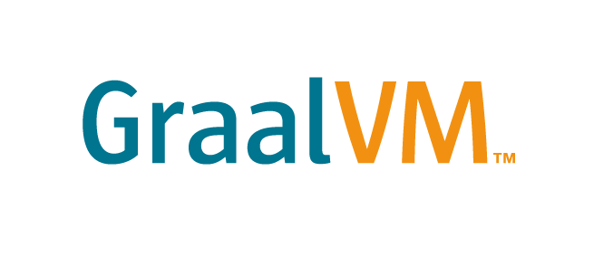

<picture>
  <source media="(prefers-color-scheme: dark)" srcset="../../images/GraalVM-rgb.png">
  <source media="(prefers-color-scheme: light)" srcset="../../images/GraalVM-rgb.png">
  
</picture>

# Get Started with GraalVM Native Image

## Introduction
This lab is for developers who want to start building cloud native Java applications using 
[GraalVM Native Image](https://docs.oracle.com/en/graalvm/enterprise/22/docs/reference-manual/native-image/).
<!-- do you want to point to the enterprise version here^^? -->

GraalVM Native Image technology compiles Java code ahead-of-time into a native executable file. Only the code that is 
required at run time by the application is included in the executable file.

An executable file produced by Native Image has several important advantages, in that it:

- Uses a fraction of the resources required by the JVM, so is cheaper to run
- Starts in milliseconds
- Delivers peak performance immediately, with no warmup
- Can be packaged into a lightweight container image for faster and more efficient deployment
- Presents a reduced attack surface (more on this in future labs)

Many of the leading microservice frameworks support ahead-of-time compilation with GraalVM Native Image, including
Micronaut, Spring, Helidon, and Quarkus.

In addition, there are Maven and Gradle plugins for Native Image, so you can easily build,
test, and run Java applications as executable files.

>Note: Oracle Cloud Infrastructure (OCI) provides GraalVM Enterprise at no additional cost.

Estimated lab time: 30 minutes

### Lab Objectives

In this lab you will perform the following tasks:

- Learn about the _GraalVM Native Image Build Tools for Maven_

### Lab Prerequisites

Before starting this lab, you must have

* Installed [GraalVM Installation 22 or greater, JDK11 +](https://www.graalvm.org/downloads/) - You can use either the Community or Enterprise Edition 
* installed the `native-image` tool (see [Native Images](https://www.graalvm.org/22.0/docs/getting-started/#native-images))
* Set your `JAVA_HOME` environment variable to point to your GraalVM installation
* Installed Maven 3.0 or above

>Note: If you see the laptop icon in the lab, this means you need to do something such as enter a command. Keep an 
eye out for it.


```
# This is where you will need to do something
```

## **STEP 1**: Build, Test, and Run the Demo Application

In this lab you will be create a small, but hopefully interesting, demo application. The application makes use of reflection so it is a good example to showcase a number of features of the _GraalVM Native Image Build Tools for Maven_. This application is also used in the [workshop on Reflection](../reflection/README.md), so if you have already completed that workshop, please feel free to skip over the description that follows of how the code works.

> ### The Closed World Assumption & Using Reflection with Native Image

> When you use the `native-image` tool (that comes with GraalVM) to create a native executable from an application, 
> it relies on knowing, at build time, about everything that can be referenced within the application code. 
> This is what is known as the "closed world" assumption. That is, everything that needs to be included in the output native
> binary must be known when it is built. Anything that is not found by static analysis, or not 
> explicitly specified in the configuration supplied to the `native-image` tool, will not be included in the executable file.
>
> You can learn more about the configuration files that are used [here](https://www.graalvm.org/22.1/reference-manual/native-image/Reflection/#manual-configuration)

Before you continue, review the build/run workflow for applications that are built using GraalVM Native Image:

1. Compile your Java source code into Java bytecode classes, `javac` / `mvn package`
2. Use the `native-image` tool to compile those Java bytecode classes into a native executable
3. Run the native executable

Let's take a quick recap of what happens during step two before we look at how we can use the GraalVM Native Build Tools for Maven to integrate this step into our Maven workflow.

Firstly, the `native-image` tool analyses your Java application to determine which classes are reachable. But, for classes that the `native-image` build tool can't determine are required, but may be required at runtime (as in our example below), then we need to add configuration to detail this - [How to Add Manual Configuration Files for Reflection](https://www.graalvm.org/22.1/reference-manual/native-image/Reflection/#manual-configuration).

Our demo application will need this and we will see how the GraalVM Native Image Build Tools can help generate this for us.

## **STEP 2**:  An Example Using Reflection

Imagine you have the following file, _DemoApplication.java_ (a copy of this can be found in the directory, 
_native-image/native-build-tools/lab_):

```java
package com.example.demo;

import java.lang.reflect.Method;

class StringReverser {
    static String reverse(String input) {
        return new StringBuilder(input).reverse().toString();
    }
}

class StringCapitalizer {
    static String capitalize(String input) {
        return input.toUpperCase();
    }
}

public class DemoApplication {
    public static void main(String[] args) throws ReflectiveOperationException, IllegalArgumentException {
        DemoApplication demo = new DemoApplication();
        System.out.println(demo.doSomething(args));
    }

    public DemoApplication() {
    }

    public String doSomething(String[] args) throws ReflectiveOperationException, IllegalArgumentException {
        if (args == null || args.length != 3) {
            //
            throw new IllegalArgumentException("Usage : Class Method InputString");
        }
        String className = args[0];
        String methodName = args[1];
        String input = args[2];

        Class<?> clazz = Class.forName(className);
        Method method = clazz.getDeclaredMethod(methodName, String.class);
        String result = (String)method.invoke(null, input);
        return result;
    }
}
```

The above code will reflectively load one of the classes, `StringReverser`, `StringCapitalizer`, and use their methods to convert a String argument. 

We have also provided unit tests that cover the various test cases and these can be found in _src/test/java/com/example/demo/DemoApplicationTests.java_. To help you 
understand how the application works, take a look at the unit tests defined in this file. These unit tests will be important later when you generate 
the extra configuration needed to build a working native binary.

In your terminal, run the following command. This will test the demo application by running the bundled unit tests:


```bash
cd native-image/native-build-tools/lab
./mvnw test
```

You should see something similar to the following, which is telling us that five unit tests ran successfully:

```bash
[INFO] -------------------------------------------------------
[INFO]  T E S T S
[INFO] -------------------------------------------------------
[INFO] Running com.example.demo.DemoApplicationTests
[INFO] Tests run: 5, Failures: 0, Errors: 0, Skipped: 0, Time elapsed: 0.053 s - in com.example.demo.DemoApplicationTests
[INFO] 
[INFO] Results:
[INFO] 
[INFO] Tests run: 5, Failures: 0, Errors: 0, Skipped: 0
[INFO] 
[INFO] ------------------------------------------------------------------------
[INFO] BUILD SUCCESS
[INFO] ------------------------------------------------------------------------
```

We can build a jar of the application easily:


```bash
./mvnw package
```
This creates a JAR file in the _target_ directory. Take a look:


```bash
ls -l target
```

You should see the following:
```bash
-rw-rw-r--. 1 opc opc 7417 Sep 14 16:47 demo-0.0.1-SNAPSHOT-jar-with-dependencies.jar
-rw-rw-r--. 1 opc opc 7379 Sep 14 16:47 demo-0.0.1-SNAPSHOT.jar
```
We can run the "fat" JAR file, which also provides a `META-INF/MANIFEST.MF` to define the main class:


```bash
java -jar ./target/demo-0.0.1-SNAPSHOT-jar-with-dependencies.jar com.example.demo.StringReverser reverse Java
```
It should produce the following output:
```
avaJ
```

Great. That worked as expected. The key things to notice with this example application is that it relies on reflection:

```java
Class<?> clazz = Class.forName(className);
Method method = clazz.getDeclaredMethod(methodName, String.class);
String result = (String)method.invoke(null, input);
```

Now that you understand the application, look at how the _Native Image Build Tools for Maven_ enable building native binaries from Maven.

## **STEP 3** Introducing the _GraalVM Native Image Build Tools for Maven_

We will use a Maven profile (for more information, see [Maven profiles](https://maven.apache.org/guides/introduction/introduction-to-profiles.html)) to separate the building of the native binary from the standard building and packaging of your Java application.

Open the file named [pom.xml](./lab/pom.xml) and take a look around. Find the profile with the ID `native`. The profile is included below:

```xml
<profiles>
    <profile>
        <id>native</id>
        <build>
            <plugins>
                ...
                <plugin>
                    <groupId>org.graalvm.buildtools</groupId>
                    <artifactId>native-maven-plugin</artifactId>
                    <version>${native.maven.plugin.version}</version>
                    <!-- Enables Junit Test Support -->
                    <extensions>true</extensions>
                    <executions>
                        <!-- Binds to the package phase - causes the native binary to be created
                            when we run, mvn -Pnative package -->
                        <execution>
                            <id>build-native</id>
                            <goals>
                                <goal>build</goal>
                            </goals>
                            <phase>package</phase>
                        </execution>
                        <!-- Binds to the test phase - causes the JUnit tests to be run as native code
                            when we run, mvn -Pnative test -->
                        <execution>
                            <id>test-native</id>
                            <goals>
                                <goal>test</goal>
                            </goals>
                            <phase>test</phase>
                        </execution>
                    </executions>
                    <!-- This section is used to configure how the native image build happens -->
                    <configuration>
                        <!-- Tracing Agent Configuration -->
                        <agent>
                            <!-- shared options -->
                            <options>
                                <option>experimental-class-loader-support</option>
                            </options>
                            <!-- test options -->
                            <options name="test">
                                <!-- Uses an access filter when running the Tracing Agent -->
                                <option>access-filter-file=${basedir}/src/test/resources/access-filter.json</option>
                            </options>
                        </agent>
                    </configuration>
                </plugin>
            </plugins>
        </build>
    </profile>
</profiles>
```

The important things to note here are:

1. It lives within a profile with ID, `native`, which means that the _GraalVM Native Image Build Tools_ plugin won't be run unless you activate the profile.
2. You must enable the extensions to the plugin with `<extensions>true</extensions>` to enable the tracing agent and JUnit support.
3. You can configure how the native image build happens in the `configuration` section.
4. You can configure how the Tracing Agent will operate in the `agent` section.
5. You must define an _access-filter_ within the configuration for the Tracing Agent.

### Note : Using the _GraalVM Native Image Build Tools_ to Generate Tracing Configuration

Because the application uses reflection we need to be aware that we have to tell the `native-image` tool about this, so that it knows to include the classes accessed by reflection in the output binary. Recall that GraalVM Native Image uses a "closed world" assumption, as discussed earlier. If you make use of reflection, which happens at runtime, you need to supply configuration files to the `native-image` build tool that detail this. Typically these are generated using the [Tracing Agent](https://www.graalvm.org/22.1/reference-manual/native-image/Agent/).

> To find out more about the Closed World assumption, which GraalVM Native Image uses to ensure only the code that is actually used is included in the output binary, please take a look at the [GraalVM Native Image Quick-start Workshop](../graalvm-native-image-quick-start/README.md).

As the demo application makes use of reflection you can make use of the tracing agent to generate this configuration. 

1. Running the unit tests and having the _GraalVM Native Image Build Tools_ inject the tracing agent into the JVM. We will look at how to do this in the next section.
2. Running your application and having the _GraalVM Native Image Build Tools_ inject the Tracing Agent into the JVM. For more information on how to do this, see [the documentation](https://graalvm.github.io/native-build-tools/latest/maven-plugin.html#agent-support-running-application).

> Note : It is important that when you use the Tracing Agent to generate this configuration that you exercise all of the paths in your code. This is one reason it is important to have a good unit test suite.

### Copying Generated Tracing Agent Configuration to Your Source Tree

In the _pom.xml_ file, you probably noticed that another plugin was included into the native profile section. It is worth discussing what this is and why we are using it. When we run the Tracing Agent on our unit tests, which we will do in the next section, the configuration files that are generated in a location within the _target_ directory, _target/native/agent-output/test_. If we want the `native-image` tool to pick these up when we build a native binary we need to relocate them to the location that it expects them to be in, that is: _src/main/resources/META-INF/native-image_.

By using the `maven-resources-plugin` we can automate this task, so that the configuration files automatically get copied into the source tree when they are available. The following configuration is required to achieve this:

```xml
<!--
    Copy over any tracing agent config generated when we run the tracing agent against the tests
-->
<plugin>
    <artifactId>maven-resources-plugin</artifactId>
    <version>3.0.2</version>
    <executions>
        <execution>
            <id>copy-agent-config</id>
            <phase>generate-sources</phase>
            <goals>
                <goal>copy-resources</goal>
            </goals>
            <configuration>
                <!-- The tracing agent config needs to be placed here to be picked up
                        by the native-image tool -->
                <outputDirectory>src/main/resources/META-INF/native-image</outputDirectory>
                <resources>
                    <resource>
                        <!-- The location that the native build tools will write the tracing agent
                                config out to -->
                        <directory>${basedir}/target/native/agent-output/test</directory>
                    </resource>
                </resources>
            </configuration>
        </execution>
    </executions>
</plugin>
```

An alternative solution would be to let the `native-image` tool know that it should look into the directory named _/target/native/agent-output/test_ for any tracing configuration. This can be achieved using the `-H:ConfigurationFileDirectories` option. At the end of this workshop we will take a look at how we can pass extra parameters, such as this, to `native-image` using the _GraalVM Native Image Build Tools for Maven_ plugin. 

## **STEP 4** Using the _GraalVM Native Image Build Tools for Maven_ to Run the Tracing Agent

So we have gone over the details of what is happening, let's take a look at actually using the tooling to generate the Tracing Agent configuration. 

From a terminal, run the following command which will run your unit tests while at the same time enabling the Tracing Agent and generating the Tracing Agent configuration for your application:


```bash
./mvnw -Pnative -DskipNativeTests=true -DskipNativeBuild=true -Dagent=true test
```
This will run your unit tests, but activating the profile that contains the _GraalVM Native Image Build Tools for Maven_ plugin, this is what the `-Pnative` does. You will also notice some other parameters that we are passing. Let's look at each of these in turn:

* `-DskipNativeTests=true` : The _GraalVM Native Image Build Tools for Maven_ can build a native executable from your unit tests and then run that, in order to check that your unit tests work for the natively compiled code. We don't want to do this just yet.
* `-DskipNativeBuild=true` : This stops the plugin from building a native binary of our application. Again, we don't want to do that just yet.
* `-Dagent=true` : This will cause the Tracing Agent to be "injected" into the application as it runs the unit tests.

We can view the newly created Tracing Agent configuration.
 

```bash
ls -l target/native/agent-output/test
```

You should see something similar to:

```bash
total 24
drwxrwxr-x. 2 opc opc    6 Sep 15 14:07 agent-extracted-predefined-classes
-rw-rw-r--. 1 opc opc  538 Sep 15 21:03 jni-config.json
-rw-rw-r--. 1 opc opc   64 Sep 15 21:03 predefined-classes-config.json
-rw-rw-r--. 1 opc opc    3 Sep 15 21:03 proxy-config.json
-rw-rw-r--. 1 opc opc 1147 Sep 15 21:03 reflect-config.json
-rw-rw-r--. 1 opc opc  375 Sep 15 21:03 resource-config.json
-rw-rw-r--. 1 opc opc   51 Sep 15 21:03 serialization-config.json
```

Now, take a moment to look at the contents of the _reflect-config.json_ file:

```json
[
{
  "name":"com.example.demo.DemoApplicationTests",
  "allDeclaredFields":true,
  "allDeclaredClasses":true,
  "queryAllDeclaredMethods":true,
  "queryAllPublicMethods":true,
  "queryAllDeclaredConstructors":true,
  "methods":[
    {"name":"<init>","parameterTypes":[] }, 
    {"name":"testCapitalise","parameterTypes":[] }, 
    {"name":"testNoParams","parameterTypes":[] }, 
    {"name":"testNonExistantClass","parameterTypes":[] }, 
    {"name":"testNonExistantMethod","parameterTypes":[] }, 
    {"name":"testReverse","parameterTypes":[] }
  ]
},
{
  "name":"com.example.demo.StringCapitalizer",
  "methods":[{"name":"capitalize","parameterTypes":["java.lang.String"] }]
},
{
  "name":"com.example.demo.StringReverser",
  "methods":[{"name":"reverse","parameterTypes":["java.lang.String"] }]
},
/* Some parts excluded for brevity */
]
```

> ### Notes on Using an Access Filter
>
> When we use the Tracing Agent to generate the configuration files from running the unit tests, we need to create an access filter to ensure that certain classes are excluded from the tracing. Make sure to take a look at the file we are using, _src/test/resources/access-filter.json_. You can learn more about the access filters [here](https://www.graalvm.org/22.0/reference-manual/native-image/Agent/#caller-based-filters).


We can see that the classes that we want to load via reflection are included, which is excellent.

## **STEP 5** Running the Unit Tests as Native Code

The _GraalVM Native Image Build Tools for Maven_ also have the ability to compile our unit tests into a native binary. This is useful as this will give us the confidence that our code will run as expected as a native binary.

We enable this behavior through the `<extensions>true</extensions>` element of the _GraalVM Native Image Build Tools for Maven_ plugin configuration. Previously we over-rode this behavior by passing in the `-DskipNativeTests=true` option that turns building a native binary of the tests off.


We can now try building natively compiled versions of our unit tests and run it. 

From the terminal run the following command (remember that we have removed the option, `-DskipNativeTests=true`):


```bash
./mvnw -Pnative -DskipNativeBuild=true -Dagent=true test
```

This will do the following:

1. Compile your code, if needed.
2. Inject the Tracing Agent and then run your Unit Tests on the JVM (**not** native).
3. Compile a native binary that will run the unit tests, to which it will pass in the newly created Tracing Configuration.
4. Run the native binary version of your tests.

You should see the following output:

```bash
Test run finished after 3 ms
[         2 containers found      ]
[         0 containers skipped    ]
[         2 containers started    ]
[         0 containers aborted    ]
[         2 containers successful ]
[         0 containers failed     ]
[         5 tests found           ]
[         0 tests skipped         ]
[         5 tests started         ]
[         0 tests aborted         ]
[         5 tests successful      ]
[         0 tests failed          ]

[INFO] ------------------------------------------------------------------------
[INFO] BUILD SUCCESS
[INFO] ------------------------------------------------------------------------
```

And, if we look within the _target_ directory we can see the native binary that was created that runs the tests, _native-tests_. We can even run this - this is a native binary of our unit tests:


```bash
./target/native-tests
```

## **STEP 6** Building the Native Binary

So far we have seen that by passing in the `-Dagent=true` option we can inject the Tracing Agent into our unit tests. We have seen that we can generate a native binary of the unit tests, which we can run independently outside of Maven. Now it is time to build a native binary of our application itself! This time we will run the same command as before, but we will remove the option that was switching off the build of the native binary of the application, `-DskipNativeBuild=true`.

Run the following from a terminal (note that this time we have also removed the `-DskipNativeBuild=true` option):


```bash
./mvnw -Pnative -Dagent=true package
```

This builds our native binary--which can be found in the _target_ directory. The default name for the generated native binary will be the name of the `artifactID` defined in the Maven _pom.xml_ file. Let's run the binary:


```bash
./target/demo com.example.demo.StringReverser reverse hello
```

```bash
olleh
```

Great, it worked! It's important to remember though that we needed to put in place the copying of the generated Tracing Agent configuration files, without which the native binary would have built, but wouldn't have been able to run. Copying the configuration generated from running the unit tests may not always be the correct solution, but it is a good starting point.

## **STEP 7** Passing Parameters to The Native Image Tool

We can wrap this workshop up with a few examples of how you can pass parameters through to the `native-image` tool whilst using the _GraalVM Native Image Build Tools for Maven_ plugin.

Let's take a look at our Maven _pom.xml_ file again. Below is a snippet from that is commented out within the configuration for the plugin:

```xml
<!--
<imageName>DeMo</imageName>
<buildArgs>
    <buildArg>-Ob</buildArg>
    <buildArg>-H:+ReportExceptionStackTraces</buildArg>
</buildArgs>
-->
```

This contains a number of elements that allow us to pass extra configuration to the `native-image` build tool during the build of the native binary. Let's take a look at each of them in turn.

Firstly we can specify what we want the output native binary file to be called, as shown in this snippet:
```xml
<imageName>DeMo</imageName>
```

This will create a native binary file named, `DeMo`. We can use this element to override the default naming of the file.

If you want to pass additional arguments to the native image builder, use <buildArgs> in the configuration of the plugin. Any of the parameters that can be passed to the `native-image` tool can be passed in using this mechanism:

```xml
<buildArgs>
    <buildArg>-Ob</buildArg>
</buildArgs>
```
In the above fragment we pass in one additional argument, `-Ob`. This is the option to enable quick build mode for GraalVM Native Image, but we can pass in any of the recognised options in this manner. For a full list of the available options available with GraalVM Native Image, try running the following command:


```bash
native-image --expert-options-all
```

Let's uncomment the section we just looked at in the _pom.xml_ file and then rebuild the application. First edit the file and remove the comments, then from the terminal, run the following command:


```bash
./mvnw -Pnative -Dagent=true clean package
```

This should build, just as before. Take a look inside the _target_ directory:


```bash
ls -l target
```

We can see that the native binary file has been created with our new name:

```bash
-rwxrwxr-x. 1 opc opc 11278976 Sep 16 16:19 DeMo
```

## Summary

In this lab, you have tried out several GraalVM Native Image features:

1. How to generate a fast native executable from a Java command line application
2. How to use Maven to build a native executable
3. How to use the tracing agent to automate the process of tracking and registering reflection calls

Write efficient, more secure, and instantly scalable cloud native Java applications with GraalVM Native Image!

NOTE: There is a gradle equivalent of _GraalVM Native Image Build Tools for Maven_!

### Learn More

- Watch a presentation by the Native Image architect Christian Wimmer [GraalVM Native Image: Large-scale static analysis for Java](https://www.youtube.com/embed/rLP-8q3Cb8M)
- [GraalVM Native Image reference documentation](https://docs.oracle.com/en/graalvm/enterprise/22/docs/reference-manual/native-image/)
- [GraalVM Native Build Tools Reference Documentation](https://graalvm.github.io/native-build-tools/latest/index.html)

