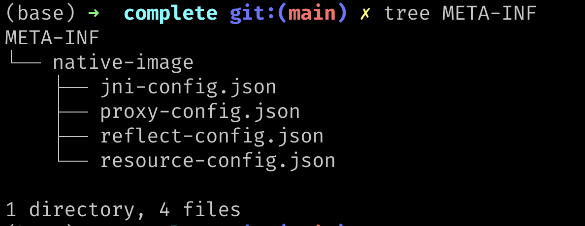

# Understanding Reflection and GraalVM Native Image

## Introduction

This lab is for developers looking to understand more about how reflection works within 
[GraalVM Native Image](https://docs.oracle.com/en/graalvm/enterprise/21/docs/reference-manual/native-image/).

GraalVM Native Image allows the ahead-of-time compilation of a Java application into a self-contained native executable. 
With GraalVM Native Image only the code that is required by the application at run time gets added into the native executable.

These native executables have a number of important advantages, in that they:

- Use a fraction of the resources required by the JVM, so cheaper to run
- Starts in milliseconds
- Deliver peak performance immediately, no warmup
- Can be packaged into lightweight container images for faster and more efficient deployments
- Reduced attack surface (more on this in future labs)

Many of the leading microservice frameworks support ahead-of-time compilation with GraalVM Native Image, including
Micronaut, Spring, Helidon, and Quarkus.

Plus, there are Maven and Gradle plugins for Native Image to make building,
testing, and running Java applications as native executables easy.

> **Note:** Oracle Cloud Infrastructure (OCI) provides GraalVM Enterprise at no additional cost.

Estimated lab time: 30 minutes

### Lab Objectives

In this lab you will perform the following tasks:

- Learn how to build Java coce that uses reflection into standalone executables, using the `native-image` build tool
- Learn about the assisted configuration tooling available with GraalVM 

**NOTE:** Whenever you see the laptop icon, this is somewhere you will need to do something. Watch out for these.


```shell
# This is where we you will need to do something
```

## **STEP 1**: The Closed World Assumption

Building standalone executable with the `nativ-image` tool that comes with GraalVM is a little different from building
Java applications. Native Image makes use of what is known as the closed World assumption. 

All that the Closed World assumption which means is that all the bytecode in the application that can be called at
runtime, must be known (observed and analysed) at build time (when the `native-image` tool is building the standalone
executable).

Before we continue it is worthwhile going over the build / run model for applications that are built with GraalVM Native Image.

1. Compile your Java source code into Java byte code classes
2. Using the `native-image` tool, build those Java byte code classes into a native executable
3. Run the native executable

But, what really happens during step 2?

Firstly, the `native-image` tool performs an analysis to see which classes within your application are reachable.
We will look at this in more detail shortly.

Secondly, found classes, that are known to be safe to be initialised 
([Automatic Initialization of Safe Classes](https://docs.oracle.com/en/graalvm/enterprise/21/docs/reference-manual/native-image/ClassInitialization/)), 
are initialised. The class data of the initialised classes is loaded into the image heap which then, in turn, gets saved 
into standalone executable (into the text section). This is one of the features of the GraalVM `native-image` tool that 
can make for such fast starting applications.

> **NOTE:** : This isn't the same as Object initialisation. Object initialisation happens during the runtime of the native executable.

We said we would return to the topic of reachability. As was mentioned earlier, the analysis determines which classes, 
methods and fields need to be included in the standalone executable. The analysis is static, that is it doesn't  run the code. 
The analysis can determine some case of dynamic class loading and uses of reflection (see ), but there are cases that it won't be able to pick up.

In order to deal with the dynamic features of Java the analysis needs to be told about what classes use reflection, or what classes
are dynamicaly loaded. 

Lets take a look at an example.

## **STEP 2**:  An Example Using Reflection

Imagine you have the following class, `ReflectionExample.java` (a copy of this cana be found in the directory, 
`demo/ReflectionExample.java`):

```java
import java.lang.reflect.Method;

class StringReverser {
    static String reverse(String input) {
        return new StringBuilder(input).reverse().toString();
    }
}

class StringCapitalizer {
    static String capitalize(String input) {
        return input.toUpperCase();
    }
}

public class ReflectionExample {
    public static void main(String[] args) throws ReflectiveOperationException {
        String className = args[0];
        String methodName = args[1];
        String input = args[2];

        Class<?> clazz = Class.forName(className);
        Method method = clazz.getDeclaredMethod(methodName, String.class);
        Object result = method.invoke(null, input);
        System.out.println(result);
    }
}
```

First, let's build the code. In your shell, run the following command:


```bash
cd demo
javac ReflectionExample.java
```

The main method in the class `ReflectionExample` loads a class whose name has been passed in as an argument, a very dynamic use case!
The second method to the class is the method name on the dynamically loaded class that should be invoked.

Let's run it and see what it does.


```bash
java ReflectionExample StringReverser reverse "hello"
```

As we expected, the method `foo` on the class `StringReverser` was found, via reflection. The method was invoked and it
reversed our input String of "hello". So far, so good.

OK, but what happens if we try to build a native image out of program? Let's try it. In your shell run the following command:


```bash
native-image --no-fallback ReflectionExample
```

> **NOTE:** The `--no-fallback` option to `native-image` causes the build to fail if it can not build a stand-alone native executabale.

Now let's run the generated native executable and see what it does:


```bash
./reflectionexample StringReverser reverse "hello"

Exception in thread "main" java.lang.ClassNotFoundException: StringReverser
	at com.oracle.svm.core.hub.ClassForNameSupport.forName(ClassForNameSupport.java:60)
	at java.lang.Class.forName(DynamicHub.java:1214)
	at ReflectionExample.main(ReflectionExample.java:21)
```

What happened here? It seems that our native executable was not able to find the class, `StringReverser`. How did this happen?
BY now, I think we probably have an idea why. The Closed World assumption.

During the analysis that the `native-image` tool performed, it was not able to determine that the class `StringReverser`
was ever used. Therefore it removed the class from the native executable it generated. Note: By removing unwanted classes from the
standalone executable, the tool to shrink the code that is built by only including classes that are known to be used. 
As we have just seen, this can casue issues with reflection, but luckily there is a way to deal with this.

## TODO **STEP 3**: Introducing Native Image Reflection Config

We can tell the `native-image` build tool about instances of reflection through special configuration files. These files are 
written in `JSON` and can be passed ot the `native-image` tool through the use of flags. Here is an example of how we
would do this for our project, if we had created the configuration files, which we haven't done yet:

```bash
# Don't run this yet - as we haven't created the config files yet!
native-image --no-fallback -H:ReflectionConfigurationFiles=config-files/reflect-config.json ReflectionExample
```

So, what other types of configuration information can we pass to the `native-image` build tool? The tooling currently
supports rading files that contain details on:

* _Reflection_
* _Resources_ - resource files that will be required by the application
* _JNI_
* _Dynamic Proxies_
* _Serialisation_

We are only looking at hwo to deal with reflection in this lab, so we will focus on that.

The following is an example o what these files look like (taken from [here](https://www.graalvm.org/22.0/reference-manual/native-image/Reflection/)):

```json
[
  {
    "name" : "java.lang.Class",
    "queryAllDeclaredConstructors" : true,
    "queryAllPublicConstructors" : true,
    "queryAllDeclaredMethods" : true,
    "queryAllPublicMethods" : true,
    "allDeclaredClasses" : true,
    "allPublicClasses" : true
  },
  {
    "name" : "java.lang.String",
    "fields" : [
      { "name" : "value" },
      { "name" : "hash" }
    ],
    "methods" : [
      { "name" : "<init>", "parameterTypes" : [] },
      { "name" : "<init>", "parameterTypes" : ["char[]"] },
      { "name" : "charAt" },
      { "name" : "format", "parameterTypes" : ["java.lang.String", "java.lang.Object[]"] }
    ]
  },
  {
    "name" : "java.lang.String$CaseInsensitiveComparator",
    "queriedMethods" : [
      { "name" : "compare" }
    ]
  }
]
```

From this we can see that classes and methods accessed through the Reflection API need to be configured. we can do this by 
hand, but the most convenient way to generate these configuration files is through use of the assisted configuration 
`javaagent`.

## **STEP 4**: Native Image, Assisted Configuration : Enter The Java Agent

Writing a complete reflection configuration file from scratch is certainly possible, but the GraalVM Java runtime provides 
a java tracing agent, the `javaagent`, that will generate this for you automatically when you run your application. 

Let's try this. First, we will create a directory to save these configuration file into:


```bash
mkdir -p META-INF/native-image
```

Then, we run the application with the tracing agent enabled. In our shell run the following:


```bash
# Note: the tracing agent parameter must come before the classpath and jar params on the command ine
java -agentlib:native-image-agent=config-output-dir=META-INF/native-image ReflectionExample StringReverser reverse "hello"
```



Let's look at the configuration created:


```bash
cat META-INF/native-image/reflect-config.json
 ```

```json
[
    {
    "name":"StringReverser",
    "methods":[{"name":"reverse","parameterTypes":["java.lang.String"] }]
    }
]
```

You can run this process mutiple times and the runs are merged if you specify `native-image-agent=config-merge-dir`, as i
s shown in the example below:


```bash
java -agentlib:native-image-agent=config-merge-dir=META-INF/native-image ReflectionExample StringCapitalizer capitalize "hello"
```

Building the standalone executable will now make use of the provided configuration. Let's build it:


```bash
native-image --no-fallback ReflectionExample
```

And let's see if it works any better:


```bash
./reflectionexample StringReverser reverse "hello"
```

It does!

## Conclusions

Building standalone executables with GraalVM Native Image relies on the Closed World assumption, that is we need to know 
in advance, when building, standalone executables about any cases of reflection that can occur in our code.

The GraalVM platform provides a way to specify, to the `native-image` build tool, when refletion is used. Note: For
some simple cases, the `native-image` tool can discover these for itself.

The GraalVM platform also provides a way to discover uses of reflection (and other dynamic behaviours) through the Java Tracing agent and
can automatically generate the configuration files needed by the `native-image` tool. 

There are a few things you should bear in mind when using the tracing agent:

* Use your test suites. You need to exercise as many paths in your code as you can
* You may need to review & edit your config files

We hope you have enjoyed this tutorial and have learnt something about how we cana deal with reflection whn using 
Native Image.

### Learn More

- Watch a presentation by the Native Image architect Christian Wimmer [GraalVM Native Image: Large-scale static analysis for Java](https://www.youtube.com/embed/rLP-8q3Cb8M)
- [GraalVM EE Native Image reference documentation](https://docs.oracle.com/en/graalvm/enterprise/21/docs/reference-manual/native-image/)
- [Reflection Use in Native Images](https://www.graalvm.org/22.0/reference-manual/native-image/Reflection/)
- [Class Initialization in Native Image](https://docs.oracle.com/en/graalvm/enterprise/21/docs/reference-manual/native-image/ClassInitialization/)
- [Assisted Configuration with Tracing Agent](https://www.graalvm.org/22.0/reference-manual/native-image/Agent/)
