<picture>
  <source media="(prefers-color-scheme: dark)" srcset="images/GraalVM-rgbrev.png">
  <source media="(prefers-color-scheme: light)" srcset="images/GraalVM-rgb.png">
  
</picture>

#  VS Code Tools for Micronaut

In this lab we will introduce you to the Micronaut&reg; tooling available within VS Code. This tooling is very feature-rich and makes building and working with Micronaut applications easy. Let's get started.


**Estimated lab time: 90 minutes**

## Lab Objectives

During this lab, we will introduce you to the Tools for Micronaut extension for VS Code. This extension supports working and building Micronaut applications. You will:

- Install VS Code and the [Tools for Micronaut extension](https://marketplace.visualstudio.com/items?itemName=oracle-labs-graalvm.micronaut-tools#:~:text=Tools%20for%20Micronaut®%20framework%20is%20a%20powerful%20extension%20for,contains%20this%20extension%20and%20others.).
- Create a Micronaut application within VS Code.
- Use the code creation automation:
  - Create a REST controller.
- Discover what the Micronaut Activity view can do:
  - Use the Micronaut Activity View to run the application.
  - Navigate around the application's endpoints and beans.
  - Make a REST call.
  - Add the Micronaut Control Panel to your application.
  - Monitor & manage your application in real-time.
- Work with an Oracle Database:
  - Connect to a database.
  - Create Micronaut Data entities, repositories from an existing database schema, and then REST controllers using the tooling.
  - Generate tests for your controllers.
- Use VisualVM from within VS Code:
  - Install VisualVM from within VS Code.
  - Use the integrated VisualVM support to solve performance issues in your application.
- Work with cloud resources in Oracle Cloud Infrastructure (OCI):
  - Learn how to work with Oracle Cloud (OCI) resources within your application.
  - Add an Object Storage bucket to your application.
  - Run the application using the attached Object Storage Bucket.

>Note: If you see the laptop icon in the lab, this means you need to do something, such as enter a command. Keep an eye out for it.


```
# This is where you will need to update a file or run a shell command.
```

>Note: If you see the keyboard icon  in the lab, this means you are being given some tasks to try. Keep an eye out for it.

>Note: Please do keep a note of any suggestions for improvements, bugs, or features that you think are missing. We will be asking you along the way to make a note of these.

## Lab Prerequisites

Before starting this lab, you must have:

* A recent install of VS Code. If you don't have it, you can [download it here](https://code.visualstudio.com/download).
* An install of the most recent version of Oracle GraalVM, JDK17. Please read the GraalVM documentation for more details: [Download Oracle GraalVM](https://www.graalvm.org/downloads/).
* An Oracle Cloud Infrastructure (OCI) account and a tenancy to work within.
* An install of the [Oracle Cloud CLI](https://docs.oracle.com/en-us/iaas/Content/API/SDKDocs/cliinstall.htm). You will need to ensure that this is configured to connect to an Oracle Cloud (OCI) tenancy that you have access to.
* An Oracle [Autonomous Transaction Processing](https://www.oracle.com/uk/autonomous-database/autonomous-transaction-processing/) (ATP) instance with the HR schema installed. If you can not create an ATP instance and install the schema then we can provide you with a pre-configured instance.
* The Oracle sample [HR schema can be found here](https://github.com/oracle-samples/db-sample-schemas). This link also contains instructions for installing. 
* An Object Storage bucket created within your OCI tenancy, that you can access.
* A Linux compute instance created within your OCI tenancy.

## Supporting Documentation

The following is a set of documentation that may prove useful when completing this lab. Please do consult the docs if anything iss unclear.

* [Tools for Micronaut Extension for VS Code.](https://marketplace.visualstudio.com/items?itemName=oracle-labs-graalvm.micronaut-tools)
* [Launch for Micronaut Extension for VS Code.](https://marketplace.visualstudio.com/items?itemName=oracle-labs-graalvm.micronaut)

## Completed Project

The code for the completed project can be found in the directory: `vscode-tools-for-micronaut/demo`. It is recommended to follow along with the lab, but if you get stuck at any point the code is available to you.

## 1 - Install the Tools for Micronaut Extension

For this lab you will need to install the following extensions into VS Code:

* [MS Extension Pack for Java](https://marketplace.visualstudio.com/items?itemName=vscjava.vscode-java-pack).
* [Tools for Micronaut® Framework](https://marketplace.visualstudio.com/items?itemName=oracle-labs-graalvm.micronaut-tools).
* [REST Client](https://marketplace.visualstudio.com/items?itemName=humao.rest-client).

You can install it directly from within the VS Code marketplace, using the links above, or through the extensions activity view within VS Code.

> **Important:** If you already have these extensions installed, you will need to update to the latest versions.

As we will be using pre-release features in this Lab, as we are keen to show you these new features, you will need to install a dev build of the following extension. 

* [Dev Build of Netbeans Language Server](https://ci-builds.apache.org/job/Netbeans/job/netbeans-vscode/2361/artifact/nbbuild/build/apache-netbeans-java-24.0.2361.vsix).

To install this extension:

* Download the extension from the link above.
* Within VS Code, open the Extensions View.
* From the banner of the Extensions, click on the three dots icon to reveal a menu and then select, `Install from VSIX`. This is shown in the image below.

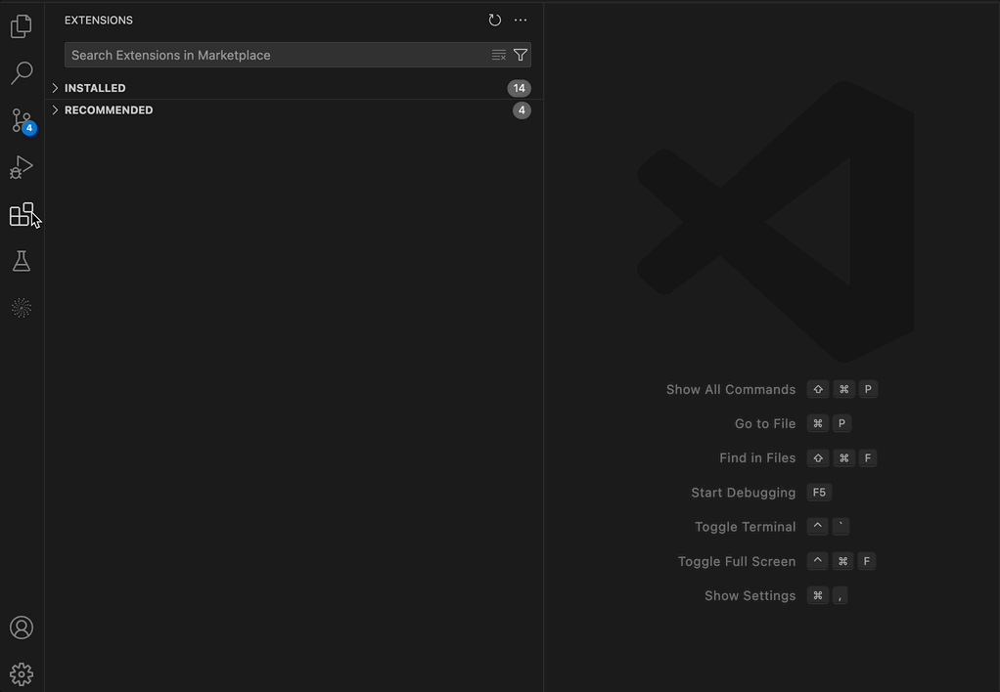

## 2 - Create a Micronaut Application

We start this lab by creating a simple Micronaut application and seeing how our tooling can progressively support us in adding features to it. We will also see how easy it is to run and interact with our application using the Tools for Micronaut, but the first step is to create an application. Let's do that now.

An application can be created using the `Micronaut Launch: Create Micronaut Project` action within the VS Code Command Palette. The Command Palette can be opened with:


```
Mac:     ⌘ + Shift + P
Windows: Ctrl + Shift + P
Linux:   Ctrl + Shift + P
```

Then search for and run, `Micronaut Launch: Create Micronaut Project`.

The wizard will walk you through the process of creating a Micronaut application. You will need to create an application with the following properties:

* Version 4.6.2
* Application Type: Micronaut Application
* Java runtime: GraalVM JDK17
* Project name: demo
* Base package: com.example
* Language: Java (our tools focus on Java support)
* Project features: Micronaut Data JDBC, Oracle Cloud Autonomous Transaction Processing (ATP), HTTP Client
* Build tool: Maven
* Test framework: JUnit

Save the project and open it in VS Code. You can add it to the current workspace, which will allow you to keep this guide open if you have opened it within VS Code.

> **Note**: If, for some reason, the Tools for Micronaut extension is disabled then during the last step of the project creation you will be asked to install the Tools for Micronaut extension again. Don't do this, just be sure to enable the extension.

Initially, we won't be using the Micronaut Data and Oracle ATP modules, but creating them now will mean that adding database functionality to our application will be easier later.

Before we do anything else, we will need to comment out all of the `datasources.*` properties in the application's `src/main/resources/application.properties`.


```properties
#datasources.default.dialect=ORACLE
micronaut.application.name=demo
#datasources.default.ocid=
#datasources.default.schema-generate=CREATE_DROP
#datasources.default.walletPassword=
oci.config.profile=DEFAULT
```

This Lab does not require support for Test Containers. As warnings and errors may be generated in the build logs if you do not have support for Test Containers, we suggest that you disable this support in the build file. As we are using maven you will need to disable the following property in the `pom.xml` file, so that it looks as below:

```xml
<micronaut.test.resources.enabled>false</micronaut.test.resources.enabled>
```

> **Note**: When connecting to OCI your local OCI CLI configuration is used. The OCI CLI uses the concept of profiles to create different user profiles for you, the user, to connect to OCI. By default, the project wizard assumes you will use your default profile to connect. If you are not, then you will need to update this later.

## 3 - Code Creation

The Tools for Micronaut extension supports creating Micronaut classes from templates. Within the right-click context menu, also launched by `CTRL + Mouse-Click`, you can see a submenu that groups all of the Micronaut context-specific actions.

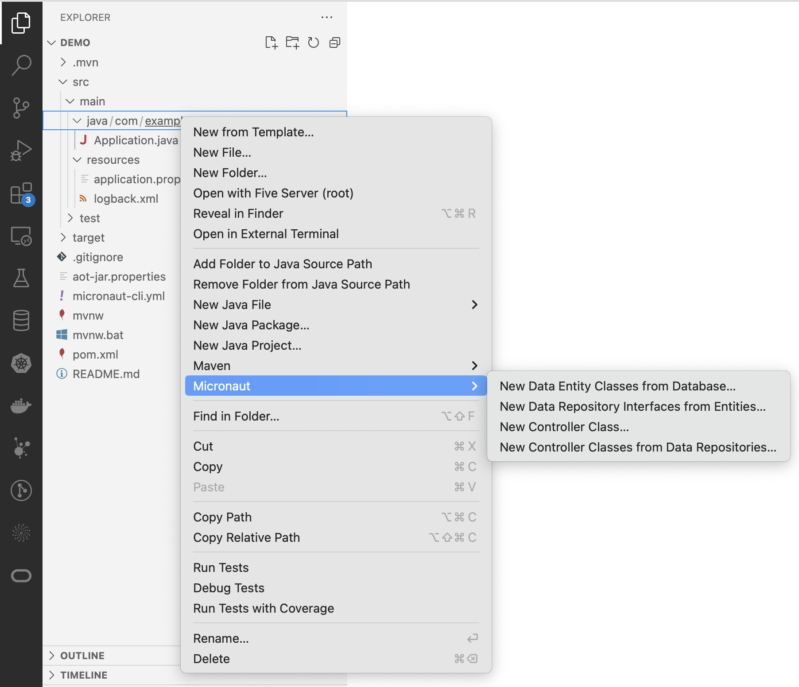

We will be using this menu to create the class.

### 3.1 - Create a REST controller

Let's start by creating a REST-based controller. We will first create a new Java package, within our base package, to hold our controller. This can easily be done within the VS Code context action menu, as shown below. Create the package, `com.example.controllers`.


Over to you:

* Create the package, `com.example.controllers`, within your project.

Once you have created the package for holding the controllers, create a new controller with the name, `PingController`. This can be done through the context menu that we introduced you to in the introduction to this section.

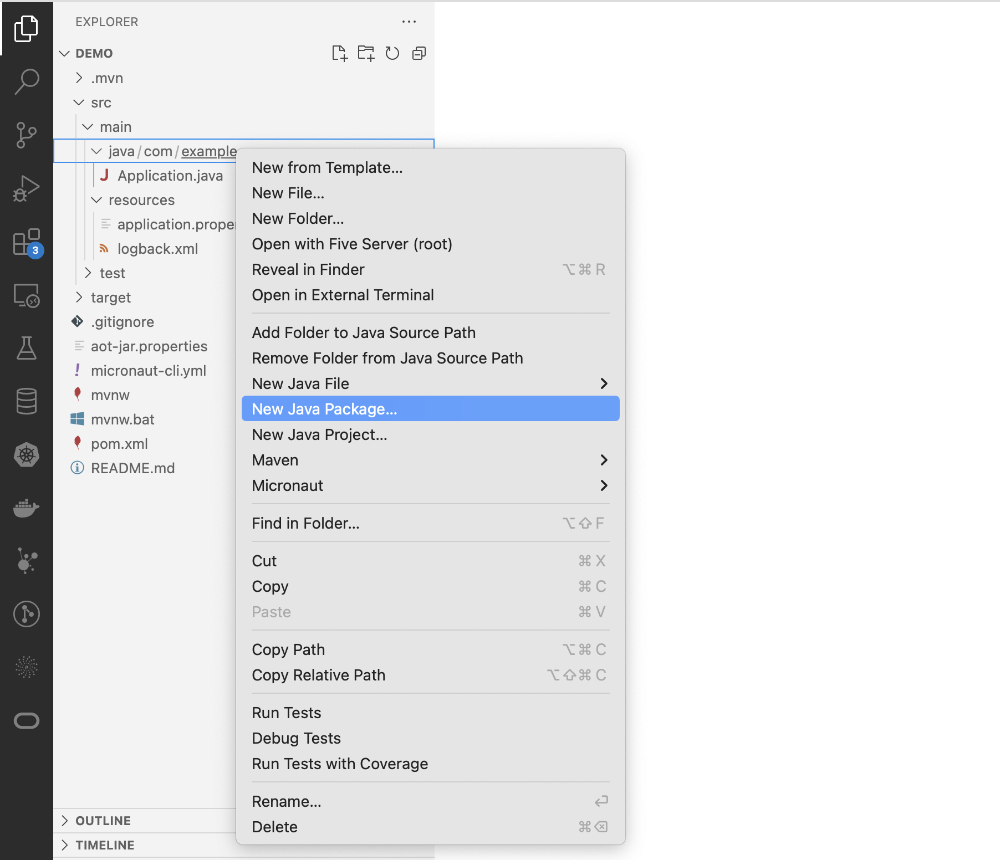

You should see the following, or similar if you changed the name.

```java
@Controller("/ping")
public class PingController {

    @Get(produces = "text/plain")
    public String get() {
        // TODO: review the generated method skeleton and provide a meaningful implementation.
        return "Example Response";
    }
}
```

You can trigger code completion, Intellisense, and suggestions within VS Code using the key combination: `CTRL + SPACE`.

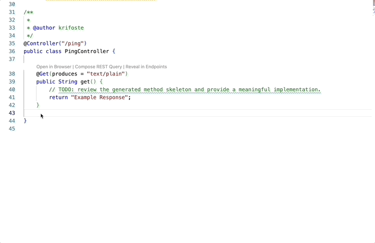


You are now going to use the code completion to add various methods to your controller.

Over to you:
* Add a `@Post` method to the controller you just created. It doesn't need to do anything with the payload, we want you to see what methods you can add and how to add to them.
* What other methods can be added to the controller?
* What code completions and code generations would you like to see added? Please make a note.

## 4 - Discover what the Micronaut Activity View Can Do

The Tools for Micronaut extension supports a custom IDE view dedicated to Micronaut. When you install the extension the icon for this view is visible on the right activity bar, as shown below. It can be displayed in the Activity Bar, or hidden, by right-clicking (`CTRL + mouse click` on MacOS) on the activity bar and either activating or deactivating it.

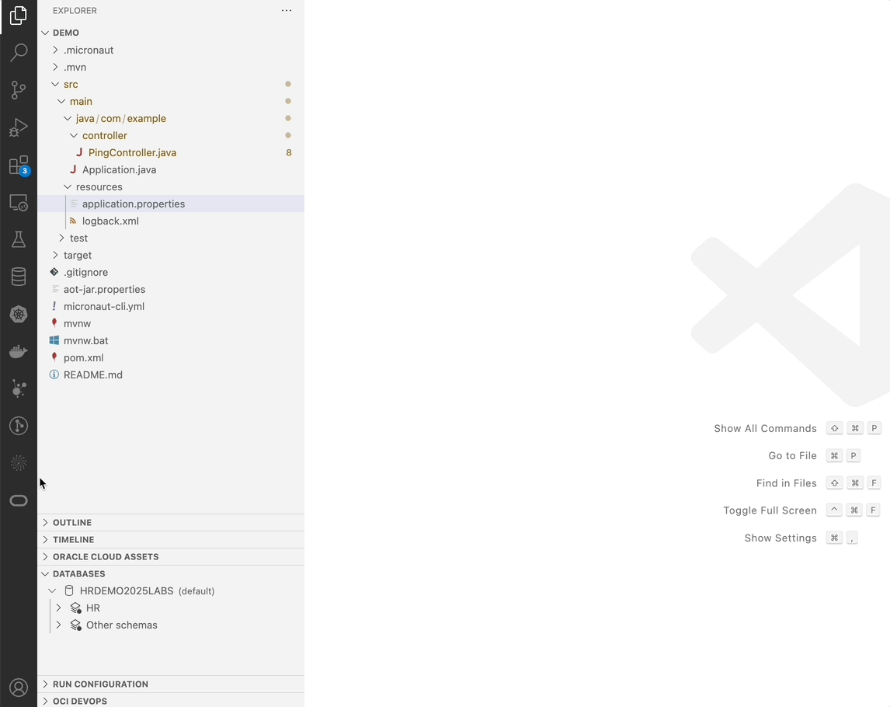

We will now use the Micronaut Activity View to run and interact with the application that we have been creating.

### 4.1 - Use the Micronaut Activity View to run the application 

The first thing we can do in the Micronaut Activity View is run our application. 

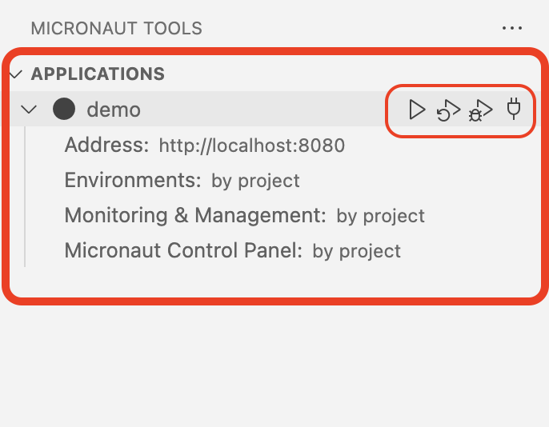

In the first panel of the Micornaut Activity View, we can see our application. By clicking on the various icons shown when we hover the mouse over the application name we can start, debug and stop our application.


Over to you:
* Start the application, and then stop it, using the view.
* Add a breakpoint to your controller class and use the Micronaut Activity view to debug your application.
* Run the application in continuous mode, then change the text generated by the controller and see what happens.
* What other features and functionality would you expect to see? Please make a note.

### 4.2 - Navigate around the endpoints and beans

Within the Micronaut Activity View, there is rich support for finding and querying beans and the HTTP endpoints of your application. We can see the panels shown in the Micronaut Activity View below.

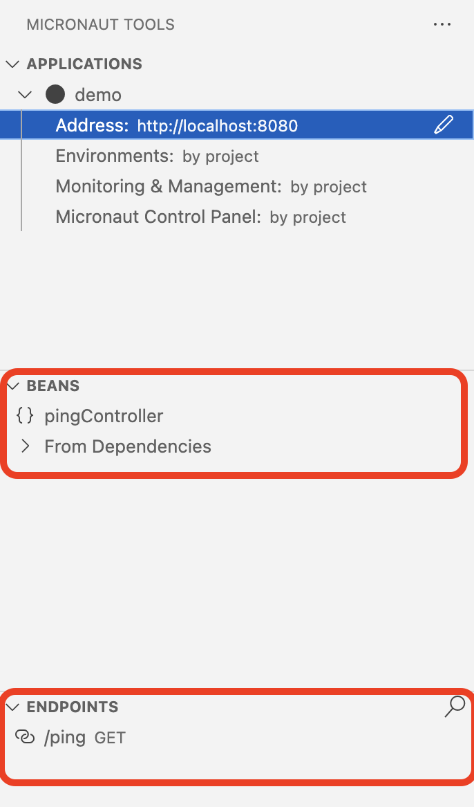

Within the `BEANS` panel, we can see the beans that have been declared within the application and those that come from dependencies. 


Over to you:
* Use the `BEANS` panel to navigate to your Controller bean.
* Use the search and filter feature of the `BEANS` panel to locate some subset of beans that come from dependencies. This can be found by clicking on the magnifying glass icon on the top right-hand side of the panel. Navigate to the source code for these beans.
* What other features would you like to see associated with the beans panel? Please make a note.

Within the `ENDPOINTS` panel we can see the endpoints that are defined within our controller. 


Over to you:
* Use the `ENDPOINTS` panel to navigate to the code defining the endpoints in the application.
* Start the application. What new features are available for the endpoint(s)?
* What other features would you like to see associated with the `ENDPOINTS` panel? Please make a note.

There is one further way to navigate around your application in VS Code and that is using the, `Go to Symbol in Workspace` tool. This is opened with the key combination of, `CTRL + T` on Windows and Linux and `⌘  + T` on MacOS. When the symbols search field is opened we can use one of the two prefixes to filter the symbols to those that we want:

* `@/` to show all defined request mappings.
* `@+` to show all defined beans.

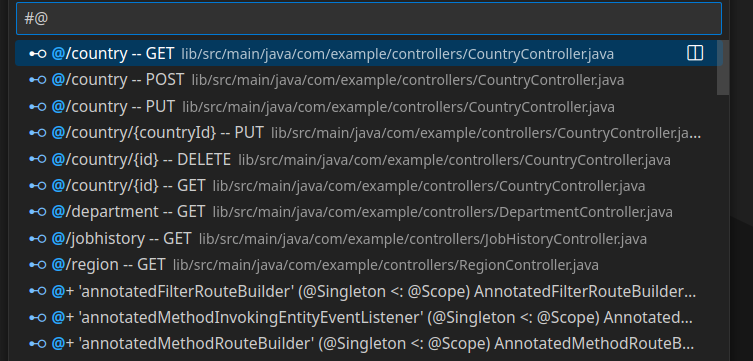

This functions similarly to what we have already seen, but it is sometimes more convenient.


Over to you:
* Use the `Go to Symbol in Workspace` to locate your controllers and endpoints.

### 4.3 - Make a REST call

We hinted in the previous section that it was possible to do more than view the endpoints of your application and you may have already discovered that you can call ednpoints. Let's take a look at exactly what you can do in more detail.


* If your application isn't running at the moment, start it now.

The first of these new icons, shown below, will open the running endpoint in a browser.

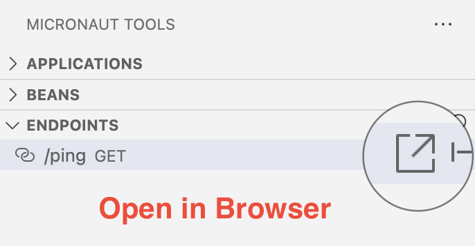


The second launches a REST composition tool that allows for composing a REST query and calling the endpoint with HTTP parameters and payloads.

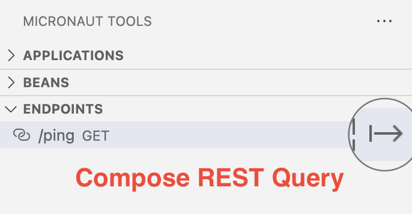

By clicking on the, `Send Request`, text above the `curl`-like query string we can send data to the endpoint and we can see the response in a side window.

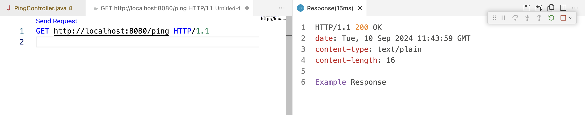


Over to you:
* Use the Compose REST Query editor to call your endpoint.
* Call the `/ping` `POST` endpoint, and compose a query and call it.
* Are there any features you would like to see? Please make a note.

### 4.4 - Add the Micronaut Control Panel to your application

The [Micronaut Control Panel](https://micronaut-projects.github.io/micronaut-control-panel/snapshot/guide/) provides a web UI that allows you to view and manage the state of your Micronaut application. The Micronaut Activity View supports integrating the Micronaut Control Panel into your application. 


* If your application is running, stop it now. We are not able to update the configuration of a running application.

To enable the control panel we can use the Application panel within the Micronaut Activity View. Click on the pencil icon to edit, choose `Enabled`, confirm updating the dependencies of your project and finally specify an environment. This is shown below.

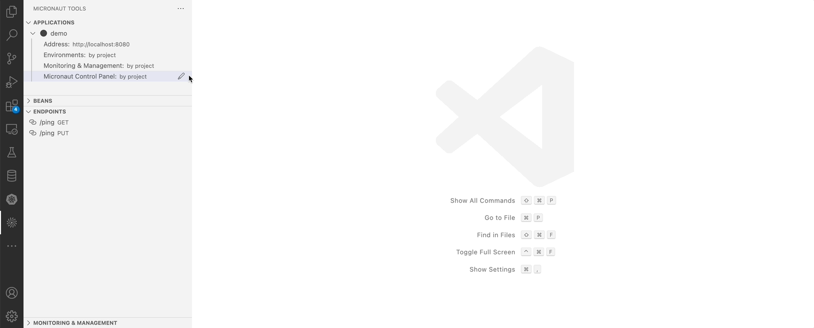

With the control panel enabled restart your application from within the Application Panel of the Micronaut Activity View and go to the Control Panel. You can open the control panel by clicking on the link icon shown in the image below.

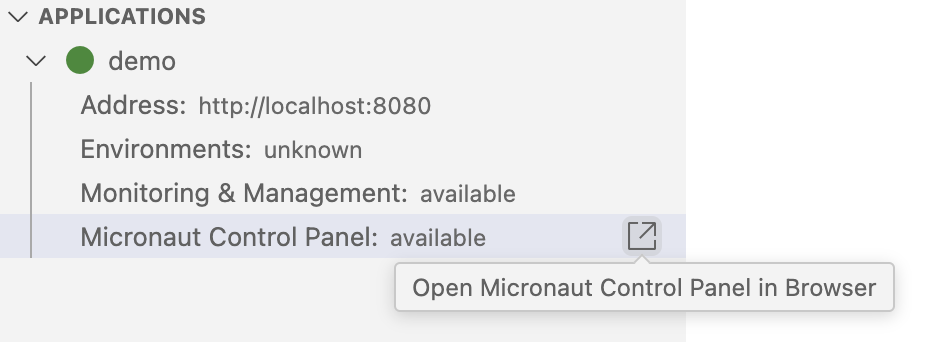


Over to you:
* Enable the Micronaut Control Panel for your application.
* Open and browse around the Control Panel for your application.
* Are there missing features for integrating with the Control Panel? Please make a note.

### 4.5 - Monitor & manage your application in real time

We can also automatically install support for monitoring and management into our application (adding support for Micronaut Micrometer and Micronaut Cache) similarly. Adding these dependencies automatically to your application allows the tooling to fetch and display real-time data on the state of the application within VS Code.  Data such as CPU utilisation, memory usage etc. are now shown in the `MONITORING & MANAGEMENT`.

First, stop your running application, so that we can update its configuration, and follow the steps shown below.

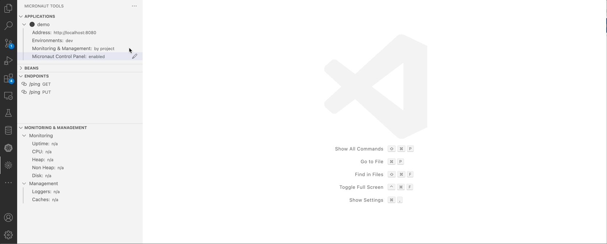


Over to you:
* Enable Monitoring and management for your application. Restart the application.
* Take a look within the `MONITORING & MANAGEMENT` panel. Notice what properties of the running application are now visible within the IDE. 
* What other features would you expect to see here? Please make a note.

## 5 - Work with an Oracle Database

The Tools for Micronaut has extensive support for working with databases and in particular the Oracle Database. We will see how we can connect VS Code with an existing Oracle Autonomous Transaction Processing instance and then use an existing database schema, within that instance, to generate our Micronaut Data model.

All of the following functionality works with MySQL as well. 

The first thing we need to do is re-enable the Micronaut Data configuration in our application's properties file, `src/main/resources/application.properties`.


Update your `src/main/resources/application.properties` file so it looks like the one below:
```properties
datasources.default.dialect=ORACLE
micronaut.application.name=demo
datasources.default.ocid=
datasources.default.schema-generate=CREATE_DROP
datasources.default.walletPassword=
oci.config.profile=DEFAULT
```

### 5.1 - Connect to a database

We first need to add a connection to a database to our project. There are several benefits to doing this:

1. When we run our application the connection properties will be injected into the application for us, so we don't need to specify any database connection details in properties files or as environment variables.
2. The database connection details are stored securely.
3. We can browse the schema of the database and generate Micronaut Data models from it.

Open the File Explorer View to reveal the `DATABASES` panel, seen below.

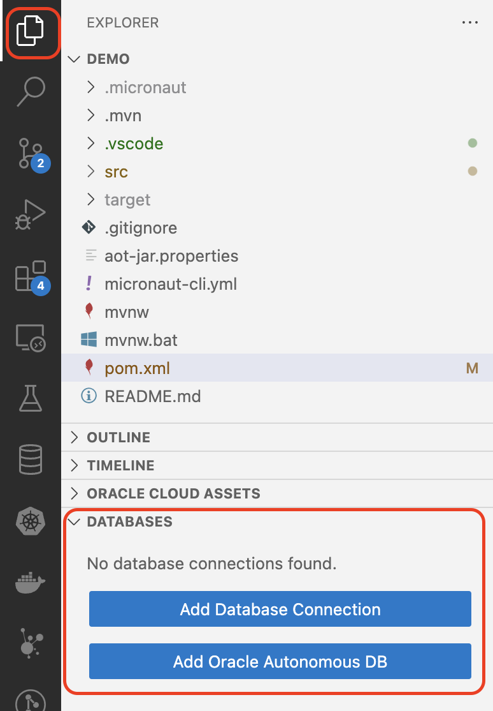

Click on the `Add Oracle Autonomous DB` button to launch the database connection wizard. This will walk you through using your OCI CLI configuration to connect to OCI, select an ATP instance and then connect to that instance. 

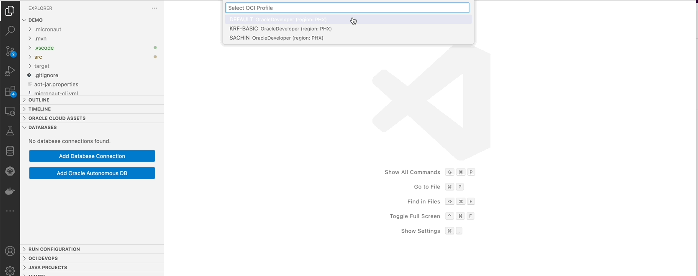

Once you have a connection you can connect to it.

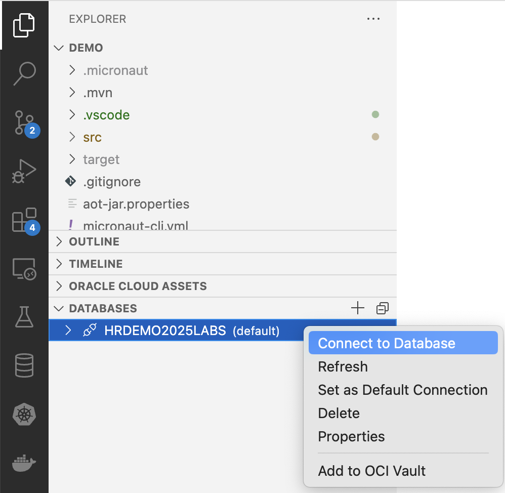

With the database connection open, you can now use the `DATABASES` panel to 


Over to you:
* Add a connection to an existing Oracle ATP instance.
* Connect to that instance and browse around the schema for the HR user.

### 5.2 - Create Micronaut Data entities, repositories from and REST controllers to expose an existing database schema

We can create Micronaut Data entity and repository classes directly from the schema within the database that we are now connected to. We will use the right click (`CMD + Mouse Click` on MacOS) context menu to do this. We will start with creating the entity classes from the HR schema.

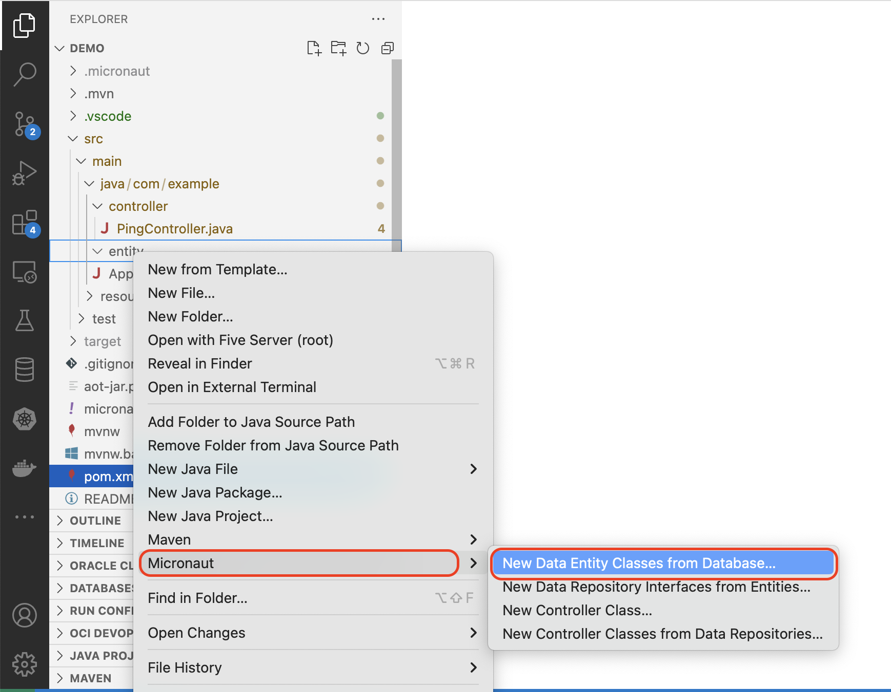

You can use the same menu to create a Micronaut Data repository class to wrap around entity classes.

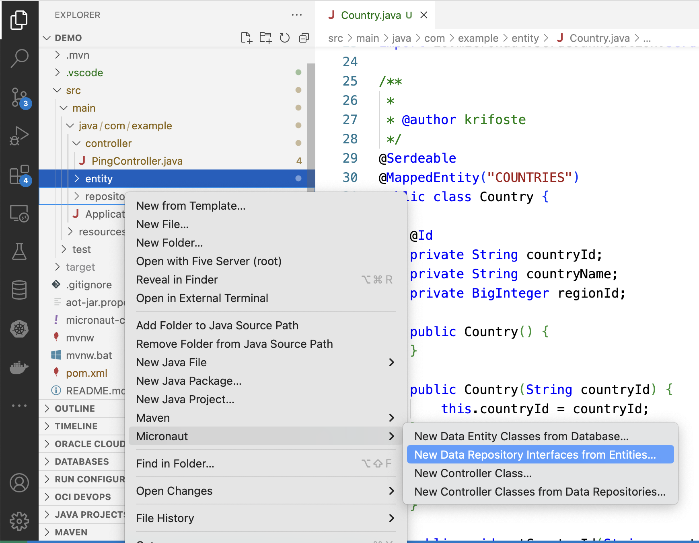


Over to you:
* Create new packages within your project: `com.example.entity`, `com.example.repository`
* Create a Micronaut Data entity class for the `COUNTRIES` table within the `com.example.entity`. This will generate an entity class, `Country`.
* Use the same context menu to create a Micronaut Data repository class that wraps around the Country entity. Do this within the `com.example.repository` package. This will create a `CountryRepository` class.

Now that we have our repository and entity created we will want to wrap that in a controller in order to expose it through a REST API.

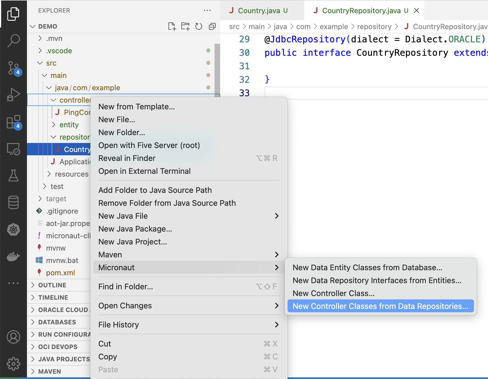


Over to you:
* Create a data controller to wrap around the repository. This will create a controller called, `CountryController`.
* Start your application and use the Micronaut Activity View. Use the `ENDPOINTS` to call the `GET` method of your controller. You should see data returned from the database.

We can use source code completion, Intellisense, to add [`findby` methods.](https://micronaut-projects.github.io/micronaut-data/latest/guide/#querying)


Over to you:
* Open the newly created repository class.
* Use the code completion, `CTRL + Space`, to generate a query (`findBy`) method to return an instance of a `Country`.
* How did you find generating query methods? Could anything be improved? Please make a note.
* Open your controller that wraps around your repository. Add a `GET` method that calls the query (`findBy`) method. Run the application and call the new endpoint using the REST compose editor.
* In the controller, use the code completion to add an `update` and a `delete` method. Test these methods in the REST query composer.
* Add a `save` method to the controller. This will accept a JSON document. Again use the REST query composer to create a new country entity.

### 5.3 - Generate tests for your controllers

Having come so far we can now complete our project by auto-generating tests. Test generation is available from the `Source action` menu. This can be accessed by right-clicking within the code editor.

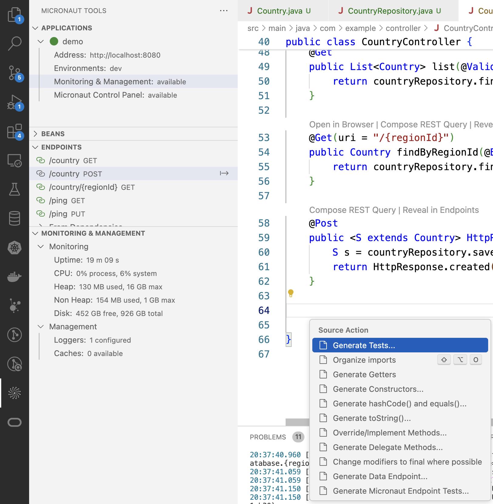


Over to you:
* Open the controller that wraps around the repository. Use the `Generate Tests` source action.
* Take a look through the generated tests. The tests are only a starting point.
* Delete the created tests before moving on.
* What could be improved? What features would you like to see added? Please make notes. 

## 6 - Use VisualVM from within VS Code

[VisualVM](https://visualvm.github.io) is a powerful visual tool for analysing and profiling your applications. It has been integrated into the tooling. We will see how the Tools for Micronaut extension can install VisualVM and how the tight integration between the extension and VisualVM allows you to find and resolve performance issues in your code.

### 6.1 - Install VisualVM from within VS Code

It is easy to install VisualVM from within Micronaut Activity View. Simply open the `MONITORING & MANAGEMENT` panel, then click on the VisuaVM logo at the top of the panel. This will install and open the VisualVM panel into the Micronaut Activity View. 


Over to you:

* Click on the `Download Latest VisualVM` button and follow along with the presented instructions. Remember, once the installation is complete you will need to set the path to the newly downloaded VisualVM by clicking on the `Select Local VisualVM installation` button.

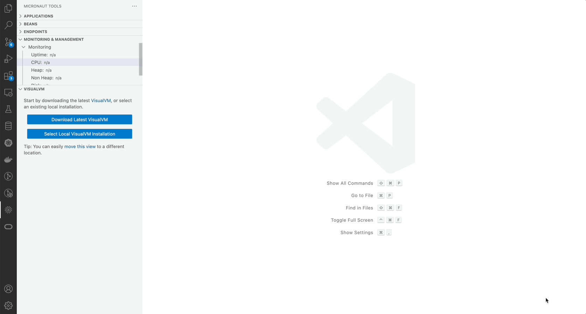

### 6.2 - Use the integrated VisualVM support to solve performance issues in your application

We will update the controller we created at the start of this lab, `PingController`. Update the `get` method so that it looks like the following code. You will notice that we have deliberately added a slowdown to the code. We are going to use the VisualVM integration to profile our code and then help us find this issue.


```java
    @Get(produces = "text/plain")
    public String get() {
        // TODO: review the generated method skeleton and provide a meaningful implementation.
        try {
            TimeUnit.SECONDS.sleep(3);
            return "Example Response";
        } catch (InterruptedException ex) {
            return null;
        }
    }
```

You will need to also add the following imports to the controller class:

```java
import java.util.concurrent.TimeUnit;
```

Save the file and then start the application using the Micronaut Activity View. 


Over to you:
* Open the VisualVM panel. Expand the `CPU Sampler` section. Click on the `Filter` action and filter to only sample classes, `Include Only Project Classes`. Click on the play icon next to `CPU Sampler` to start the sampling. This will launch VisualVM.
* Return to VS Code. Use the `ENDPOINTS` panel to call the `/ping` `GET` endpoint. This is the endpoint that we deliberately made slow.
* Return to VisualVM. Right-click on the sample, and select, `Expand / Collapse` > `Expand Topmost Path`. This will order the callpath. Drill into the innermost element and you should find our call to `sleep`. Surrounding this will be our `get` method. Right-click and select `Go to Source`. This will return you to the offending code.
* Don't forget to clean up. Stop the application and kill VisualVM.
* What other useful integrations would you like to see? Please make a note.

## 7 - Work with Cloud Resources in OCI

One of the most important aspects of building applications these days is integration with the cloud. We will see how, by using the Tools for Micronaut, we can simplify working with cloud-based resources, such as object storage buckets.

### 7.1 - Learn how to work with Oracle Cloud (OCI) resources within your application

Micronaut supports working with many cloud providers, but the Tools for Micronaut extension only supports working with [Oracle Cloud (OCI)](https://www.oracle.com/cloud/). In this section, we will see how the tooling accelerates building an application that works with OCI.

### 7.2 - Add an Object Storage bucket to your application

Let's look at the `ORACLE CLOUD ASSETS` panel which can be found in the file explorer view. The image below shows you how to locate it.

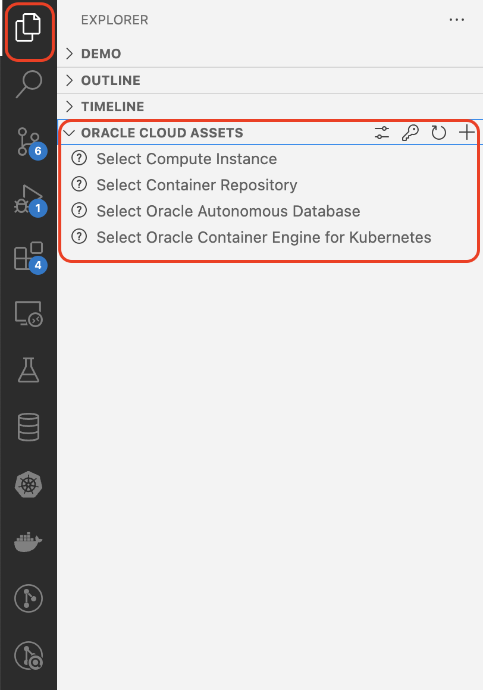

Within the panel you can see several cloud asset types that might apply to this project: Compute Instance; Container Repository; Oracle Autonomous Database; and Oracle Container Engline for Kubernetes; The tooling looks at your project dependencies and deduces what cloud assets it will require. In this case, we don't rely on any cloud assets apart from the database. It adds, by default, cloud asset types such as container registry, compute and Kubernetes as these will apply to all projects. You will always need somewhere to run your application and you will typically need somewhere to put your container images.

As well as deducing what your project is currently using the tooling also allows you to add to your project. If you want to add an object storage bucket to your project the tooling will:

* Add the dependencies that are required.
* Add Object Storage to the Cloud View. 
* Select a particular Object Storage bucket to work with.

We can see how this takes place below:

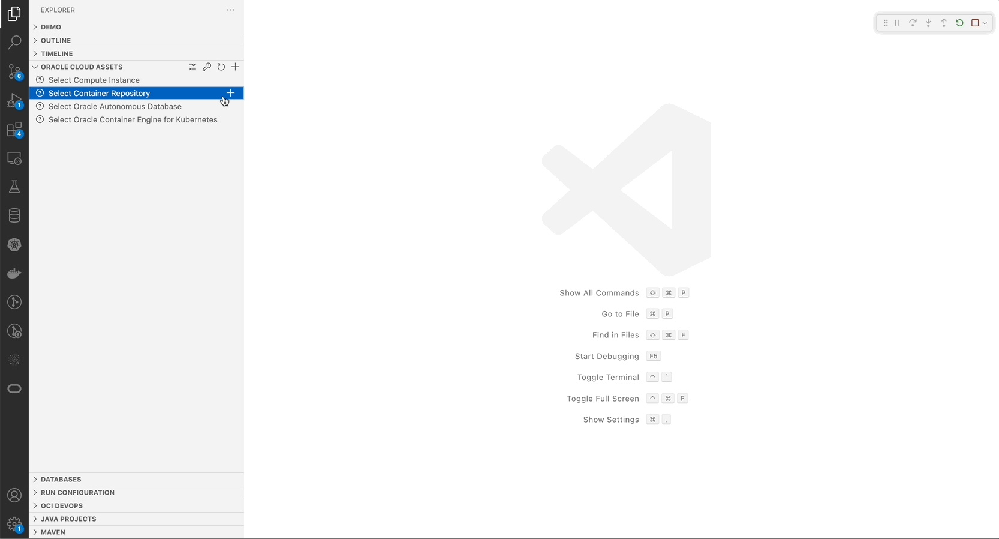

The tooling manages the configuration required for all these cloud assets and injects this configuration into your application when you run it in VS Code. You can view the configuration properties in use by clicking the sliders icon in the `ORACLE CLOUD ASSETS` panel. This is shown below:

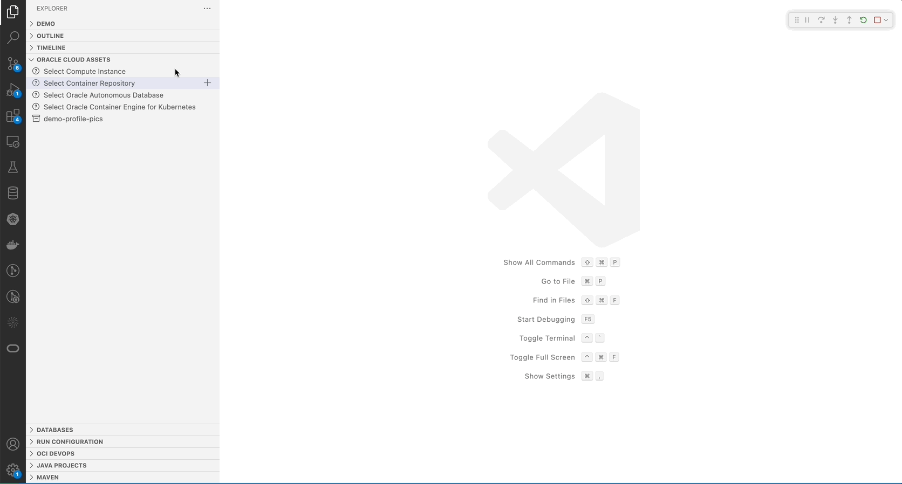

This is great if you want to save this configuration and use it in a deployed environment. The tooling also supports creating a Kubernetes Config Map from the configuration that can be used in conjunction with our OCI DevOps tooling (which is not discussed in the lab, but you can read more [about it here](https://marketplace.visualstudio.com/items?itemName=oracle-labs-graalvm.oci-devops)).

> These configuration properties are passed to the application through an environment varibale, `MICRONAUT_CONFIG_FILES`. When you run the application through the tooling the run command string is updated to set this variable to the location of a temporary file containing the application configuration. When you next run the application through the tooling take a moment to examine the run command shown so that you can see this for yourself.

/usr/bin/env JDT_LAUNCHWRAP_CWD=/Users/krifoste/repos/workshops/vscode-micronaut-expression-language/demo 
    JDT_LAUNCHWRAP_PROJECT_SCRIPTS=/var/folders/kg/y51b7gjd6nj63_dzgdnt_1hr0000gn/T/ext-dir.4QKxJeVX6F/oracle-labs-graalvm.micronaut-tools-0.6.7/resources/launch-wrappers 
    JDT_LAUNCHWRAP_PROJECT_TYPE=Maven 
    JDT_LAUNCHWRAP_PROJECT_CONTAINER=micronaut 
    JDT_LAUNCHWRAP_PROJECT_DIR=/Users/krifoste/repos/workshops/vscode-micronaut-expression-language/demo 
    JDT_LAUNCHWRAP_PROJECT_ROOT=/Users/krifoste/repos/workshops/vscode-micronaut-expression-language/demo 
    JDT_LAUNCHWRAP_PROJECT_LAUNCHER=/var/folders/kg/y51b7gjd6nj63_dzgdnt_1hr0000gn/T/ext-dir.4QKxJeVX6F/oracle-labs-graalvm.micronaut-tools-0.6.7/agent JDT_LAUNCHWRAP_MICRONAUT_CONTINUOUS=false 
    MICRONAUT_CONFIG_FILES=/var/folders/kg/y51b7gjd6nj63_dzgdnt_1hr0000gn/T/usr-dir.BjbQjh5kYz/User/workspaceStorage/bf3e8e0e0d22b704ebb741ac01817893/asf.apache-netbeans-java/userdir/var/cache/nbls.db.connection/db-2911445290496334280.properties
    /var/folders/kg/y51b7gjd6nj63_dzgdnt_1hr0000gn/T/ext-dir.4QKxJeVX6F/oracle-labs-graalvm.micronaut-tools-0.6.7/resources/launch-wrappers/launcher.sh /Users/krifoste/.sdkman/candidates/java/17.0.12-graal/bin/java 
    @/var/folders/kg/y51b7gjd6nj63_dzgdnt_1hr0000gn/T/cp_4kz9ftbwfqflziowjib1d4pgv.argfile
    com.example.Application 


### 7.3 - Run the application using the attached Object Storage Bucket

We should now add some code to use the object storage bucket. The following code is taken from the Micronaut Guide: [USE THE MICRONAUT OBJECT STORAGE API TO STORE FILES IN ORACLE CLOUD INFRASTRUCTURE (OCI) OBJECT STORAGE](https://guides.micronaut.io/latest/micronaut-object-storage-oracle-cloud.html).

Create the following Java interface in your application, with the location: `src/main/java/com/example/controllers/ProfilePicturesApi.java`:


```java
package com.example.controllers;

import java.util.Optional;
import io.micronaut.http.HttpRequest;
import io.micronaut.http.HttpResponse;
import io.micronaut.http.MediaType;
import io.micronaut.http.HttpStatus;
import io.micronaut.http.annotation.Delete;
import io.micronaut.http.annotation.Get;
import io.micronaut.http.annotation.Post;
import io.micronaut.http.annotation.Status;
import io.micronaut.http.multipart.CompletedFileUpload;
import io.micronaut.http.server.types.files.StreamedFile;

public interface ProfilePicturesApi {

    @Post(uri = "/{userId}", consumes = MediaType.MULTIPART_FORM_DATA) 
    HttpResponse upload(CompletedFileUpload fileUpload, String userId, HttpRequest<?> request);

    @Get("/{userId}") 
    Optional<HttpResponse<StreamedFile>> download(String userId);

    @Status(HttpStatus.NO_CONTENT) 
    @Delete("/{userId}") 
    void delete(String userId);
}
```

And now create the following controller in your application, with the location: `src/main/java/com/example/controllers/ProfilePicturesController.java`:


```java
package com.example.controllers;

import io.micronaut.http.HttpRequest;
import io.micronaut.http.HttpResponse;
import io.micronaut.http.MutableHttpResponse;
import io.micronaut.http.annotation.Controller;
import io.micronaut.http.multipart.CompletedFileUpload;
import io.micronaut.http.server.types.files.StreamedFile;
import io.micronaut.http.server.util.HttpHostResolver;
import io.micronaut.http.uri.UriBuilder;
import io.micronaut.objectstorage.ObjectStorageEntry;
import io.micronaut.objectstorage.ObjectStorageOperations;
import io.micronaut.objectstorage.request.UploadRequest;
import io.micronaut.objectstorage.response.UploadResponse;
import io.micronaut.scheduling.TaskExecutors;
import io.micronaut.scheduling.annotation.ExecuteOn;

import java.net.URI;
import java.util.Optional;

import static io.micronaut.http.HttpHeaders.ETAG;
import static io.micronaut.http.MediaType.IMAGE_JPEG_TYPE;

@Controller(ProfilePicturesController.PREFIX)
@ExecuteOn(TaskExecutors.IO)
class ProfilePicturesController implements ProfilePicturesApi {

    static final String PREFIX = "/pictures";

    private final ObjectStorageOperations<?, ?, ?> objectStorage;
    private final HttpHostResolver httpHostResolver;

    ProfilePicturesController(ObjectStorageOperations<?, ?, ?> objectStorage,
                              HttpHostResolver httpHostResolver) {
        this.objectStorage = objectStorage;
        this.httpHostResolver = httpHostResolver;
    }

    @Override
    public HttpResponse<?> upload(CompletedFileUpload fileUpload,
                                  String userId,
                                  HttpRequest<?> request) {
        String key = buildKey(userId);
        UploadRequest objectStorageUpload = UploadRequest.fromCompletedFileUpload(fileUpload, key);
        UploadResponse<?> response = objectStorage.upload(objectStorageUpload);

        return HttpResponse
                .created(location(request, userId))
                .header(ETAG, response.getETag());
    }

    private static String buildKey(String userId) {
        return userId + ".jpg";
    }

    private URI location(HttpRequest<?> request, String userId) {
        return UriBuilder.of(httpHostResolver.resolve(request))
                .path(PREFIX)
                .path(userId)
                .build();
    }

    @Override
    public Optional<HttpResponse<StreamedFile>> download(String userId) {
        String key = buildKey(userId);
        return objectStorage.retrieve(key)
                .map(ProfilePicturesController::buildStreamedFile);
    }

    private static HttpResponse<StreamedFile> buildStreamedFile(ObjectStorageEntry<?> entry) {
        StreamedFile file = new StreamedFile(entry.getInputStream(), IMAGE_JPEG_TYPE).attach(entry.getKey());
        MutableHttpResponse<Object> httpResponse = HttpResponse.ok();
        file.process(httpResponse);
        return httpResponse.body(file);
    }

    @Override
    public void delete(String userId) {
        String key = buildKey(userId);
        objectStorage.delete(key);
    }
}
```

We now have a controller that can use an object storage bucket.


Over to you:
* You should already have an Object Storage bucket created within a tenancy that you can access on OCI. If you haven't already, please create an Object Storage bucket now. You can find out how in [these instructions](https://docs.oracle.com/en-us/iaas/Content/Object/Tasks/managingbuckets_topic-To_create_a_bucket.htm).
* Add the two classes shown above to your code. Start the application using the Micronaut Activity View.

Now you have your application running we will need to upload some data. Unfortunately, the Compose REST Query tool within the Micronaut Activity view does not currently support uploading files correctly, so we will call the endpoint to upload a file from the shell. A new shell can be opened as follows, remember to leave the shell with the running application within it untouched.

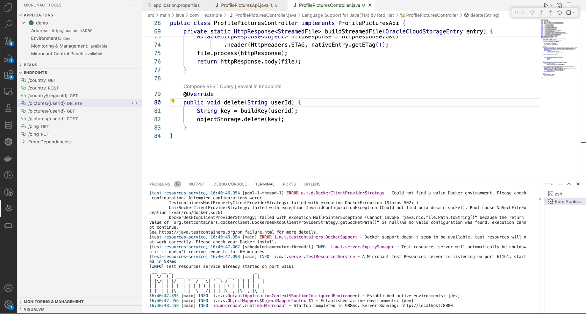


Over to you:
* Call the Pictures API that we just added from a new shell in VS Code. The `curl` script is shown below:
  ```bash
  curl -i -F 'fileUpload=@images/GraalVM-rgb.png' http://localhost:8080/pictures/graalvm
  ```
* When you have uploaded the image, open the `ENDPOINTS` panel within the Micronaut Activity View and call the `GET` endpoint for `/pictures/{userId}`.
* Did everything work and were you able to fetch the image from Object Storage? Was the process easy and if not what could be improved? Please make a note.

### 7.4 - Generate OCI policy statements

The final step in the OCI tools story is moving your code to the cloud. There are several ways that this can be done. We can build a container, push it to a container repository and then to Kubernetes. We could build a container, push it and then run the container on a compute instance in the cloud. We won't have time to go into these in detail today, but we would ask you to experiment with the `ORACLE CLOUD ASSETS` panel and try these out yourself.

When running code in the cloud security is of paramount importance and within OCI security is enforced through [Identity and Access Management (IAM) policies](https://docs.oracle.com/en-us/iaas/Content/Identity/Concepts/policygetstarted.htm). These policies describe which cloud assets can be accessed and by whom and much more. In our case, we would need to configure policies to allow our Object Storage bucket to be accessed by a process running on a compute instance using instance principals (which you can find out read more about [here](https://docs.oracle.com/en-us/iaas/Content/Identity/Tasks/callingservicesfrominstances.htm)).

Let's look at how the tooling can help generate the required policies.


Over to you:
* Open the `ORACLE CLOUD ASSETS` panel. Remember, it can be found in the File Explorer View.
* Add a compute instance. You can do this by clicking the `plus` icon next to `Select Compute Instance` in the `ORACLE CLOUD ASSETS` panel.

  > We select a compute instance as a destination to deploy our code to. This will give us the opportunity to generate the required IAM policies to run the code from that compute instance.

* With a compute instance selected as a place to run our code, when packaged as a container, we can now generate our policies. Click on the `key` icon in the banner of the `ORACLE CLOUD ASSETS` panel. This will open an editing window containing the required IAM policies. You can copy these into the OCI console and run them using the [Policy Builder tool](https://docs.oracle.com/en-us/iaas/Content/Identity/policymgmt/managingpolicies_topic-Using_the_Policy_Builder.htm).


## Summary

We hope you have enjoyed this lab and learnt a few things along the way. Although we have only touched upon what is possible with the Tools for Micronaut you have seen some of the variety of benefits offered, which include:

* The ability to monitor and manage you rapplication from within VS Code.
* Easy code creation for a host of mundane tasks.
* Easily connecting to and working with databases.
* Creating complete REST APIs from existing database schemas.
* Intuitive support for calling REST APIs.
* Profiling and solving performance problems.
* Easy integration with OCI Cloud assets and resources.

If you are interested in the other features that are offered by the Tools for Micronaut extension for VS Code you could try the following Lab:

* [Using the Micronaut Expression Language within VS Code Tools for Micronaut](../vscode-micronaut-expression-language/README.md)

Thanks for taking the time to do this lab!

Micronaut® is a registered trademark of Object Computing, Inc. Use is for referential purposes and does not imply any endorsement or affiliation with any third-party product.
