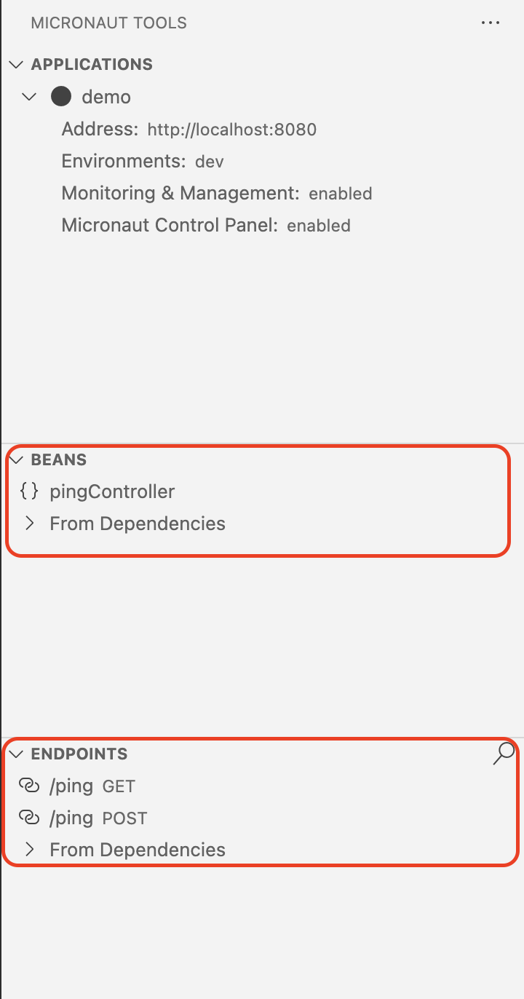

<picture>
  <source media="(prefers-color-scheme: dark)" srcset="images/GraalVM-rgbrev.png">
  <source media="(prefers-color-scheme: light)" srcset="images/GraalVM-rgb.png">
  
</picture>

#  VS Code Tools for Micronaut

In this lab we will introduce you to the Micronaut&reg; tooling available within VS Code. This tooling is very feature-rich and makes building and working with Micronaut applications easy. Let's get started.


**Estimated lab time: 90 minutes**

## Lab Objectives

During this lab, we will introduce you to the Tools for Micronaut extension for VS Code. This extension supports working and building Micronaut applications. You will:

- Install VS Code and the Tools for Micronaut extension.
- Create a Micronaut application within VS Code.
- Use the code creation automation:
  - Create a REST controller.
- Discover what the Micronaut Activity view can do:
  - Use the Micronaut Activity View to run the application.
  - Navigate around the application's endpoints and beans.
  - Make a REST call.
  - Add the Micronaut Control Panel to your application.
  - Monitor & manage your application in real-time.
- Use autocomplete within properties files.
- Use the Micronaut Expression Language.
- Work with an Oracle Database:
  - Connect to a database.
  - Create Micronaut Data entities, repositories from an existing database schema, and then REST controllers using the tooling.
  - Generate tests for your controllers.
- Use Visual VM from within VS Code:
  - Install Visual VM from within VS Code.
  - Use the integrated Visual VM support to solve performance issues in your application.
- Work with cloud resources in Oracle Cloud Infrastructure (OCI):
  - Learn how to work with Oracle Cloud (OCI) resources within your application.
  - Add an Object Storage bucket to your application.
  - Run the application using the attached Object Storage Bucket.

>Note: If you see the laptop icon in the lab, this means you need to do something, such as enter a command. Keep an eye out for it.


```
# This is where you will need to update a file or run a shell command.
```

>Note: If you see the keyboard icon  in the lab, this means you are being given some tasks to try. Keep an eye out for it.

>Note: Please do keep a note of any suggestions for improvements, bugs, or features that you think are missing. We will be asking you along the way to make a note of these.

## Lab Prerequisites

Before starting this lab, you must have:

* A recent install of VS Code. If you don't have it, you can [download it here](https://code.visualstudio.com/download).
* An install of the most recent version of Oracle GraalVM. Please read the GraalVM documentation for more details: [Download Oracle GraalVM](https://www.graalvm.org/downloads/).
* An install of the [Oracle Cloud CLI](https://docs.oracle.com/en-us/iaas/Content/API/SDKDocs/cliinstall.htm).
* An Oracle [Autonomous Transaction Processing](https://www.oracle.com/uk/autonomous-database/autonomous-transaction-processing/) (ATP) instance with the HR schema installed. If you can not create an ATP instance and install the schema then we can provide you with a pre-configured instance.
* The Oracle sample [HR schema can be found here](https://github.com/oracle-samples/db-sample-schemas). This link also contains instructions for installing. 


## Supporting Documentation

The following is a set of documentation that may prove useful when completing this lab. Please do consult the docs if anything iss unclear.

* [Tools for Micronaut Extension for VS Code.](https://marketplace.visualstudio.com/items?itemName=oracle-labs-graalvm.micronaut-tools)
* [Launch for Micronaut Extension for VS Code.](https://marketplace.visualstudio.com/items?itemName=oracle-labs-graalvm.micronaut)

## Install the Tools for Micronaut Extension

For this lab you will need to install the following two extensions into VS Code:

* [MS Extension Pack for Java](https://marketplace.visualstudio.com/items?itemName=vscjava.vscode-java-pack).
* [Tools for Micronaut® Framework](https://marketplace.visualstudio.com/items?itemName=oracle-labs-graalvm.micronaut-tools).

You can install it directly from within the VS Code marketplace, using the links above, or through the extensions activity view within VS Code.

## Create a Micronaut Application

We start this lab by creating a simple Micronaut application and seeing how our tooling can progressively support us in adding features to it. We will also see how easy it is to run and interact with our application using the Tools for Micronaut, but the first step is to create an application. Let's do that now.

An application can be created using the `Micronaut Launch: Create Micronaut Project` action within the VS Code Command Palette. The Command Palette can be opened with:


```
Mac:     ⌘ + Shift + P
Windows: Ctrl + Shift + P
Linux:   Ctrl + Shift + P
```

Then search for and run, `Micronaut Launch: Create Micronaut Project`.

The wizard will walk you through the process of creating a Micronuat application. You will need to create an application with the following properties:

* Version 4.6.1
* Application Type: Micronaut Application
* Java runtime: GraalVM JDK21
* Project name: demo
* Base package: com.example
* Language: Java (our tools focus on Java support)
* Project features: Micronaut Data JDBC, Oracle Cloud Autonomous Transaction Processing (ATP), HTTP Client
* Build tool: You choose
* Test framework: JUnit

Save the project and open it in VS Code. You can add it to the current workspace, which will allow you to keep this guide open if you have opened it within VS Code.

Initially, we won't be using the Micronaut Data and Oracle ATP modules, but creating them now will mean that adding database functionality to our application will be easier later.

Before we do anything else, we will need to comment out all of the `datasources.*` properties in the application's `src/main/resources/application.properties`.


```properties
#datasources.default.dialect=ORACLE
#datasources.default.dialect=UTC
micronaut.application.name=demo
#datasources.default.ocid=
#datasources.default.schema-generate=CREATE_DROP
#datasources.default.walletPassword=
oci.config.profile=DEFAULT
```

## Code Creation

The Tools for Micronaut extension supports creating Micronaut classes from templates. Within the right-click context menu, also launched by `CTRL + Mouse-Click`, you can see a submenu that groups all of the Micronuat context-specific actions.


We will be using this menu to create classe.

## Create a REST controller

Let's start by creating a REST-based controller. We will first create a new Java package, within our base package, to hold our controller. This can easily be done within the VS Code context action menu, as shown below.


Once you have created the package for holding the controllers, create a new controller with the name, `PingController`. You should see the following, or similar if you changed the name.

```java
@Controller("/ping")
public class PingController {

    @Get(produces = "text/plain")
    public String get() {
        // TODO: review the generated method skeleton and provide a meaningful implementation.
        return "Example Response";
    }
}
```

You can trigger code completion, Intellisense, and suggestions within VS Code using the key combination: `CTRL + SPACE`.


Over to you:
* Add a `@POST` method to the controller you just created. It doesn't need to do anything with the payload.
* What other methods can be added to the controller?
* What code completions and code generations would you like to see added? Please make a note.

## Discover what the Micronaut Activity View Can Do

The Tools for Micronaut extension supports a custom IDE view dedicated to Micronaut. When you install the extension the icon for this view is visible on the right activity bar, as shown below. It can be displayed in the Activity Bar, or hidden, by right-clicking (`CTRL + mouse click` on MacOS) on the activity bar and either activating or deactivating it.


We will now use the Micronaut Activity View to run and interact with the application that we have been creating.

### Use the Micronaut Activity View to run the application 

The first thing we can do in the Micronaut Activity View is run our application. 


In the first panel of the Micornaut Activity View, we can see our application. By clicking on the various icons shown when we hover the mouse over the application name we can start, debug and stop our application.


Over to you:
* Start the application, and then stop it, using the view.
* Add a breakpoint to your controller class and use the Micronaut Activity view to debug your application.
* Run the application in continuous mode, then change the text generated by the controller and see what happens.
* What other features and functionality would you expect to see? Please make a note.

### Naviagte around the endpoints and beans

Within the Micronaut Activity View, there is rich support for finding and querying beans and the HTTP endpoints of your application. We can see the panels shown in the Micronaut Activity View below.



Within the `BEANS` panel, we can see the beans that have been declared within the application and those that come from dependencies. 


Over to you:
* Use the `BEANS` panel to navigate to your Controller bean.
* Use the search and filter feature of the `BEANS` panel to locate some subset of beans that come from dependencies. Navigate to the source code for these beans.
* What other features would you like to see associated with the beans panel? Please make a note.

Within the `ENDPOINTS` panel we can see the endpoints that are defined within our controller. 


Over to you:
* Use the `ENDPOINTS` panel to navigate to the code defining the endpoints in the application.
* Start the application. What new features are available for the endpoint(s)?
* What other features would you like to see associated with the `ENDPOINTS` panel? Please make a note.

There is one further way to navigate around your application in VS Code and that is using the, `Go to Symbol in Workspace` tool. This is opened with the key combination of, `CTRL + T` on Windows and Linux and `⌘  + T` on MacOS. When the symbols search field is opened we can use one of the two prefixes to filter the symbols to those that we want:

* `@/` to show all defined request mappings.
* `@+` to show all defined beans.


This functions similarly to what we have already seen, but it is sometimes more convenient.


Over to you:
* Use the `Go to Symbol in Workspace` to locate your controllers and endpoints.

### Make a REST call

We hinted in the previous section that it was possible to do more than view the endpoints of your application. When your application is running, the endpoints panel will provide further icons that allow you to call an endpoint.


* If your application isn't running at the moment, start it now.

The first of these new icons, shown below, will open the running endpoint in a browser.


The second launches a REST composition tool that allows for composing a REST query and calling the endpoint with HTTP parameters and payloads.


By clicking on the, `Send Request`, text above the `curl`-like query string we can send data to the endpoint and we can see the response in a side window.


Over to you:
* Use the Compose REST Query editor to call your endpoint.
* Add another endpoint, using `POST`, and compose a query and call it.
* Are there any features you would like to see? Please make a note.

### Add the Micronaut Control Panel to your application

The [Micronaut Control Panel](https://micronaut-projects.github.io/micronaut-control-panel/snapshot/guide/) provides a web UI that allows you to view and manage the state of your Micronaut application. The Micronaut Activity View supports integrating the Micronaut Control Panel into your application. 


* If your application is running, stop it now. We are not able to update the configuration of a running application.

To enable the control panel we can use the Application panel within the Micronaut Activity View. Click on the pencil icon to edit, choose `Enabled`, confirm updating the dependencies of your project and finally specify an environment. This is shown below.


With the control panel enabled restart your application from within the Application Panel of the Micronaut Activity View and go to the Control Panel. You can open the control panel by clicking on the link icon shown in the image below.


Over to you:
* Enable the Micronaut Control Panel for your application.
* Open and browse around the Control Panel for your application.
* Are there missing features for integrating with the Control Panel? Please make a note.

### Monitor & manage your application in real time

We can also automatically install support for monitoring and management into our application (adding support for Micronaut Micrometer and Micronaut Cache) in a similar way. First stop your running application, so that we can update its configuration, and follow the steps shown below.


Over to you:
* Enable Monitoring and management for your application. Restart the application.
* Take a look within the `MONITORING & MANAGEMENT` panel. Notice what properties of the running application are now visible within the IDE.
* Add a custom logger to your application and some custom logging to your controller. Restart the application & play with controlling the logging from within the `MONITORING & MANAGEMENT` panel. We also have support for managing caches in a very similar manner.
* What other features would you expect to see here? Please make a note.


## Autocomplete within properties files

TODO: Named data sources will be coming in a future release.

## Use the Micronaut Expression Language

TODO

## Work with an Oracle Database

The Tools for Micronaut has extensive support for working with databases and in particular the Oracle Database. We will see how we can connect VS Code with an existing Oracle Autonomous Transaction Processing instance and then use an existing database schema, within that instance, to generate our Micronaut Data model.

All of the following functionality works with MySQL as well. 

The first thing we need to do is re-enable the Micronaut Data configuration in our application's properties file, `src/main/resources/application.properties`.


Update your `src/main/resources/application.properties` file so it looks like the one below:
```properties
datasources.default.dialect=ORACLE
datasources.default.dialect=UTC
micronaut.application.name=demo
datasources.default.ocid=
datasources.default.schema-generate=CREATE_DROP
datasources.default.walletPassword=
oci.config.profile=DEFAULT
```

### Connect to a database

We first need to add a connection to a database to our project. There are several benefits to doing this:

1. When we run our application the connection properties will be injected into the application for us, so we don't need to specify any database connection details in properties files or as environment variables.
2. The database connection details are stored securely.
3. We can browse the schema of the database and generate Micronaut Data models from it.

Open the File Explorer View to reveal the `DATABASES` panel, seen below.


Click on the `Add Oracle Autonomous DB` button to launch the database connection wizard. This will walk you through using your OCI CLI configuration to connect to OCI, select an ATP instance and then connect to that instance. 


Once you have a connection you can connect to it.


With the database connection open, you can now use the `DATABASES` panel to 


Over to you:
* Add a connection to an existing Oracle ATP instance.
* Connect to that instance and browse around the schema for the HR user.

### Create Micronaut Data entities, repositories from and REST controllers to expose an existing database schema

We can create Micronaut Data entity and repository classes directly from the schema within the database that we are now connected to. We will use the right click (`CMD + Mouse Click` on MacOS) context menu to do this. We will start with creating the entity classes from the HR schema.


You can use the same menu to create a Micronaut Data repository class to wrap around entity classes.


Over to you:
* Create new packages within your project: `com.example.entity`, `com.example.repository`
* Create a Micronaut Data entity class for the `COUNTRIES` table within the `com.example.entity`. This will generate an entity class, `Country`.
* Use the same context menu to create a Micronaut Data repository class that wraps around the Country entity. Do this within the `com.example.repository` package. This will create a `CountryRepository` class.

Now that we have our repository and entity created we will want to wrap that in a controller in order to expose it through a REST API.


Over to you:
* Create a data controller to wrap around the repository. This will create a controller called, `CountryController`.
* Start your application and use the Micronaut Activity View. Use the `ENDPOINTS` to call the `GET` method of your controller. You should see data returned from the database.

We can use source code completion, Intellisense, to add [`findby` methods.](https://micronaut-projects.github.io/micronaut-data/latest/guide/#querying)


Over to you:
* Open the newly created repository class.
* Use the code completion, `CTRL + Space`, to generate a query (`findBy`) method to return an instance of a `Country`.
* How did you find generating query methods? Could anything be improved? Please make a note.
* Open your controller that wraps around your repository. Add a `GET` method that calls the query (`findBy`) method. Run the application and call the new endpoint using the REST compose editor.
* In the controller, use the code completion to add an `update` and a `delete` method. Test these methods in the REST query composer.
* Add a `save` method to the controller. This will accept a JSON document. Again use the REST query composer to create a new country entity.

### Generate tests for your controllers

Having come so far we can now complete our project by auto-generating tests. Test generation is available from the `Source action` menu. This can be accessed by right-clicking within the code editor.


Over to you:
* Open the controller that wraps around the repository. Use the `Generate Tests` source action.
* Take a look through the generated tests. The tests are only a starting point.
* What could be improved? What features would you like to see added? Please make notes. 

## Use Visual VM from within VS Code

[VisualVM](https://visualvm.github.io) is a powerful visual tool for analysing and profiling your applications. It has been integrated into the tooling. We will see how the Tools for Micronaut extension can install VisualVM and how the tight integration between the extension and VisualVM allows you to find and resolve performance issues in your code.

### Install Visual VM from within VS Code

TODO

### Use the integrated Visual VM support to solve performance issues in your application

TODO

## Work with Cloud Resources in OCI

TODO

### Learn how to work with Oracle Cloud (OCI) resources within your application

TODO

### Add an Object Storage bucket to your application

TODO

### Run the application using the attached Object Storage Bucket

TODO

## Summary

We hope you have enjoyed this lab and learnt a few things along the way. You have seen the variety of benefits offered by the Tools for Micronaut extension. These include:

* The ability to monitor and manage you rapplication from within VS Code.
* Easy code creation for a host of mundane tasks.
* Easily connecting to and working with databases.
* Creating complete REST APIs from existing database schemas with 

## Learn More

- Watch a presentation by the Native Image architect Christian Wimmer [GraalVM Native Image: Large-scale static analysis for Java](https://www.youtube.com/embed/rLP-8q3Cb8M)
- [GraalVM Native Image reference documentation](https://docs.oracle.com/en/graalvm/enterprise/21/docs/reference-manual/native-image/)

Micronaut® is a registered trademark of Object Computing, Inc. Use is for referential purposes and does not imply any endorsement or affiliation with any third-party product.